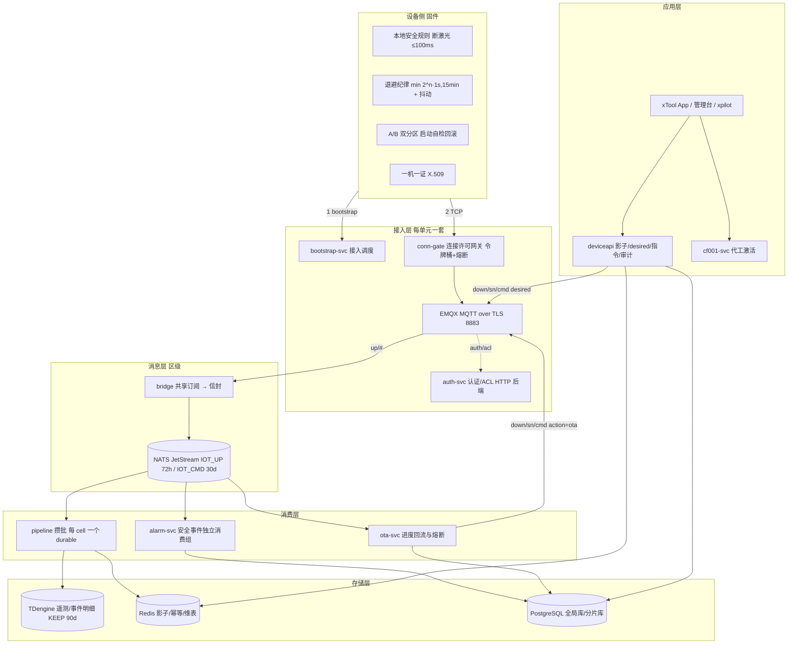
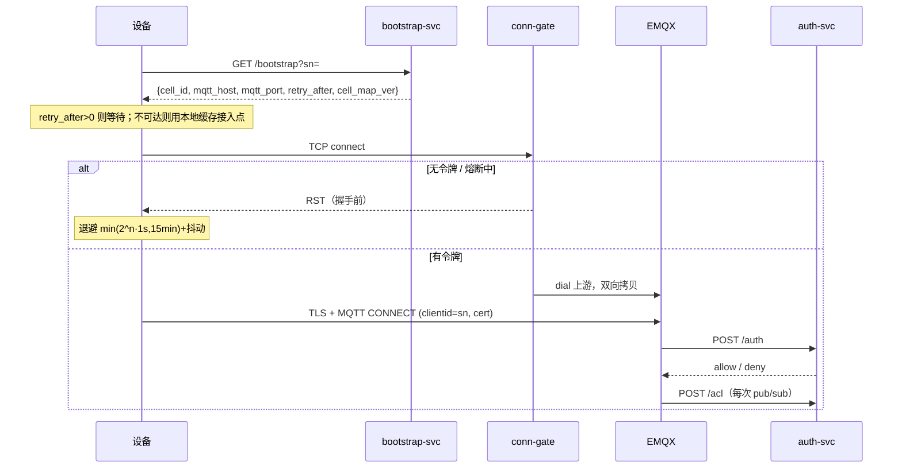
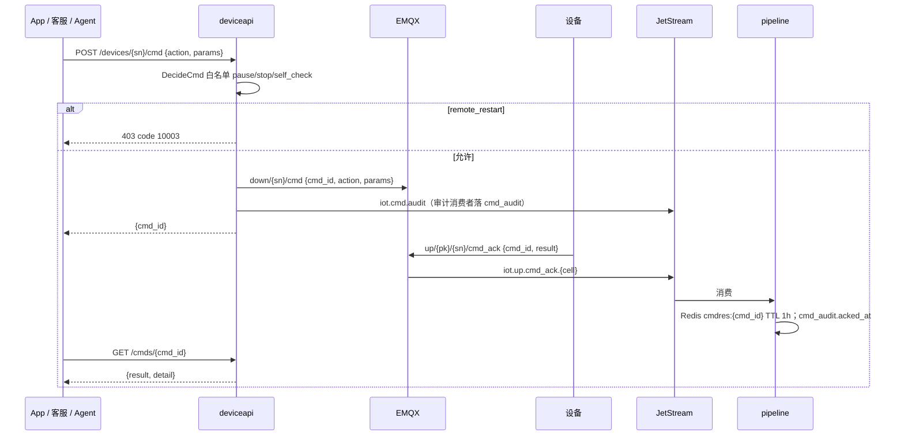

# xTool AIoT 平台技术方案

> Technical Design · 设备云平台 · 18 章

| 项 | 内容 |
|---|---|
| 文档版本 | v0.1 评审稿 · 2026-09-18 |
| 对应 PRD | docs/prd-bl1-consumer-laser.md（BL1 消费级激光整机） |
| 工程契约 | docs/spec.md（所有服务必须遵守的接口、Topic、DDL 与纪律） |
| 工程仓库 | github.com/xuweisheng001/x-aiot，Go 1.24，11 个服务 + 共享包 |
| 定位 | P0 阶段面向 BL1，架构一次按六条业务线共用底座设计；本仓库为可运行的技术预研原型，不是生产系统 |
| 配套文档 | docs/cf001-impl.md · docs/drill-runbook.md · docs/incident-register-storm.md · docs/loadtest-report.md |

**三条设计原则**（全文反复引用）

1. **安全闭环在端侧**。火焰、超温、倾斜、急停、水流五类安全事件由固件本地规则断激光，云端只做通知、留痕、复核。断网不降低安全性。
2. **不可事后补救的东西进第一版固件**。重连退避、一机一证、A/B 双分区三件套是固件红线，未锁定排期不进迭代。
3. **护栏做成约束，不做成流程**。全量 OTA 双人审批是数据库 CHECK，告警状态迁移是带前置状态的 UPDATE，配额超发是 CHECK。代码写错，库也不允许。

## 目录

1. [业务线定义与 AIoT 场景](#01-业务线定义与-aiot-场景)
2. [目标与 SLO](#02-目标与-slo)
3. [总体架构](#03-总体架构)
4. [连接风暴防护](#04-连接风暴防护)
5. [设备身份与接入认证](#05-设备身份与接入认证)
6. [核心链路](#06-核心链路)
7. [消息契约与物模型](#07-消息契约与物模型)
8. [数据管道与三层存储](#08-数据管道与三层存储)
9. [安全事件与告警](#09-安全事件与告警)
10. [隐私合规与数据治理](#10-隐私合规与数据治理)
11. [OTA 灰度与熔断](#11-ota-灰度与熔断)
12. [远程控制与审计](#12-远程控制与审计)
13. [可观测性](#13-可观测性)
14. [容量规划与性能口径](#14-容量规划与性能口径)
15. [容灾与单元化运维](#15-容灾与单元化运维)
16. [落地手册](#16-落地手册)
17. [数据模型](#17-数据模型)
18. [分步实现](#18-分步实现)

---

## 01 业务线定义与 AIoT 场景

设备云不是某一条业务线的项目，而是六条业务线共用的底座。P0 只为 BL1 交付功能，但接入、影子、事件、OTA、指令五条链路按全部业务线的形态设计。

| 业务线 | AIoT 场景 | 关键指标 | 阶段 |
|---|---|---|---|
| BL1 消费级整机 | 联网激活与影子、火焰超温端侧停机加 App 告警、远程看摄像头进度、OTA、错误码上报 | 联网激活率、周活设备率、重大安全事故率 | P0 |
| BL2 配件与安全生态 | 主机作业时净化器自动启停调档、滤芯按实际风量算寿命并提醒、灭火事件上云留痕 | 配件连带率、滤芯复购率 | P1 |
| BL3 耗材与材料 | 激光模块健康度按发光时长乘功率加权、镜片污染估计、App 一键下单；材料识别带出官方参数 | 耗材复购率、提醒到下单转化率、材料 GMV | P1 |
| BL4 软件与内容 | App 成为设备云入口、XCS 参数库按机型材料与模块健康度动态校正、数据反哺参数推荐、云素材订阅 | App 设备绑定率、订阅转化率 | P0 入口，P2 订阅 |
| BL5 教育与 B 端 | 教室多机看板、上课时段外禁用、批量 OTA、按班级任务队列、工作室多机调度与耗材集采 | B 端付费账号、单校设备数、续费率 | P2 |
| BL6 售后与保修 | 工单自动附遥测与错误码、AI 诊断 Agent 读状态跑自检、保修判定按工时与事件留痕数据化、批次缺陷早于客诉发现 | 一次解决率、单工单时长、保修争议率 | P1 |

**对架构的约束**

- 物模型必须版本化（productKey + schemaVersion），未知字段透传落明细，BL2 配件与 BL3 耗材字段后加不改管道。
- 指令通道必须区分来源（App / 客服 / Agent）并全量审计，BL6 的 Agent 才能接入。
- 遥测只含 SN，身份映射只在 PII 平台，BL5 的多租户与 BL6 的工单附遥测才不会踩隐私红线。
- 小时级降采样长期保留，BL3 的健康度与 BL6 的保修判定依赖它。

---

## 02 目标与 SLO

### 2.1 P0 试点要求与架构容量

| 维度 | P0 试点要求 | 架构容量（一次设计到位） |
|---|---|---|
| 设备规模 | beta 100 台 → 量产出厂即联网 | 1000 万保有 / 300 万并发在线 / 30 万 msg/s |
| 接入可用性 | 99.9%（单区单单元 staging） | 99.95% / 单元 / 月，单元故障不算全局故障 |
| 安全事件端到端 | 设备事件 → App 推送到达 P99 < 3 s | 同 |
| 指令往返 | 在线设备 P99 < 2 s | 同 |
| 数据新鲜度 | 影子与明细 lag < 30 s | 同 |
| OTA 全量周期 | 试点批次 ≤ 7 天 | ≤ 14 天 / 千万台，差分为主 |
| 连接风暴 | staging 回放 3000 台零错峰重连，网关限速生效、broker 无雪崩 | 100 万台 10 分钟内重连（约 1700 conn/s） |
| 容灾 | 单元 kill 演练 RTO ≤ 30 min，影子由 JetStream 重放重建 | 热备单元 + Bootstrap 限速调度 |
| 安全 | mTLS 一机一证、Topic ACL、指令白名单、审计全量、证书吊销 5 s 生效 | 同；签名私钥进 HSM |
| 隐私 | 摄像头 opt-in、遥测只含 SN、区内驻留、删号传导 | 三区驻留，跨区仅脱敏聚合 |

### 2.2 SLO 的测量点

每条 SLO 都必须能从系统里量出来，而不是估出来。

| SLO | 起点 | 终点 | 中间记录点 |
|---|---|---|---|
| 安全事件触达 | 设备 event.ts（经服务端接收时间纠偏） | 推送服务回执 | envelope.recv_ts（桥接接收）、alarm.notified_at |
| 指令往返 | cmd_audit.created_at | cmd_audit.acked_at | Redis cmdres:{cmd_id} 写入时间 |
| 数据新鲜度 | envelope.recv_ts | TDengine 行写入 / Redis 影子写入 | JetStream consumer NumPending |
| 接入可用性 | conn-gate accepted / rejected 计数 | EMQX 连接数 | auth-svc deny 原因分布 |

三段分别记录，慢在哪一跳一眼可见。

---

## 03 总体架构

### 3.1 分层视图



### 3.2 服务清单

| 服务 | 端口 | 职责 | 代码 |
|---|---|---|---|
| bootstrap-svc | 8081 | 设备开机先问接入点：sn → cell → mqtt 地址 / retry_after；单元 drain / overload 内部接口 | internal/bootstrap |
| auth-svc | 8082 | EMQX HTTP 认证与 ACL 后端：SN 格式、设备状态、证书指纹、Topic 白名单 | internal/auth |
| conn-gate | 1884 → 1883 | TCP 连接许可网关：令牌桶 + 上游熔断，无票在握手前 RST | internal/conngate |
| bridge | — | EMQX 共享订阅 → 统一信封 → JetStream 按 cell 分 subject；JetStream 不可用时事件进磁盘缓冲 | internal/bridge |
| pipeline | — | 每 cell 一个 durable consumer；解析 → 富化 → 幂等 → 分发；攒批写 TDengine + Redis 影子 | internal/pipeline |
| deviceapi | 8083 | 影子读、desired 写、RRPC 指令、指令结果、审计落库、遥测查询 | internal/deviceapi |
| alarm-svc | 8085 | 安全事件独立消费组、squelch、状态机、升级 | internal/alarm |
| ota-svc | 8086 | 固件登记、灰度批次圈选下发、进度回流、熔断、双人审批 | internal/ota |
| cf001-svc | 8087 | 代工机型激活：RSA-OAEP 载荷、配额事务、23 位 SN、PSS 签名 | internal/cf001 |
| device-simulator | — | 模拟设备：bootstrap → 退避重连 → 遥测/事件/回执；可注入坏固件与 OTA 失败 | internal/simulator |
| loadgen | — | 压测三剧本：conn / storm / flood | internal/loadgen |

共享包 internal/pkg：envelope（信封与 subject）、cellmap（SN → cell 哈希）、backoff（退避）、dedupe（幂等）、shadow（影子 key）、tdengine（REST 客户端与多表批量 INSERT）、httpx（响应与限流中间件）、config。任何服务不得复制一份自己的版本。

### 3.3 单元化与区域

- **区域（Region）**：US / EU / APAC，数据不出区。P0 只建 US 单区，只接美区用户。
- **单元（Cell）**：一个区内若干单元，每单元一套接入层（conn-gate + EMQX + auth）、独立容量上限。设备归属单元由 `cellmap.CellOf(sn, N) = fnv32a(sn) % N + 1` 决定，bridge 与 bootstrap 必须用同一函数。
- **区级共享**：JetStream、TDengine、Redis、PG 分片库按区部署，单元只是接入面的隔离单位。单元故障不算全局故障。
- **全局库**：product、thing_model、cell、firmware、ota_batch 跨区只读复制，写在主区。

### 3.4 为什么这样切

| 决策 | 备选 | 选择理由 |
|---|---|---|
| EMQX 前面加 conn-gate 自研 TCP 网关 | 只靠 EMQX 自身限速 | EMQX 限速在 TLS 握手之后生效，风暴时 CPU 已经被握手吃掉；网关在握手前 RST，成本是一个 accept |
| EMQX → NATS JetStream 而不是直接消费 EMQX | EMQX 规则引擎直写 TDengine | 需要 72 小时可重放的持久流来重建影子、重放事件；JetStream 比 Kafka 运维轻，吞吐够 P0 到千万级 |
| 每 cell 一个 durable consumer | 全局一个 consumer | 单元故障只影响该 cell 的消费进度；flusher 可按 cell 并行 |
| TDengine 存明细 | ClickHouse / InfluxDB | 超级表按 SN 建子表天然契合设备模型；REST 写入路径简单，KEEP 与流计算内建 |
| Redis 影子 + PG desired | 全放 PG | reported 是可再生的（JetStream 重放），desired 是用户意图不可再生；分开存，各取所长 |
| 指令走 MQTT down topic + JetStream 审计流 | HTTP 长轮询 | 设备已有持久会话；审计走独立流，指令本身失败不影响审计落库 |

---

## 04 连接风暴防护

这是全方案唯一「没做对就无法事后补救」的部分。设备一旦铺出去，固件里的重连逻辑就是埋在客户家里的定时炸弹。来源：docs/incident-register-storm.md 记录的一次真实事故，固定 5 秒重试 + 无索引查询导致生产线停线 30 分钟。

### 4.1 四道防线

```
设备端退避（固件红线）  →  bootstrap retry_after（调度层削峰）  →  conn-gate 令牌桶（握手前 RST）  →  上游熔断（塌陷不再送流量）
```

| 防线 | 位置 | 机制 | 参数 |
|---|---|---|---|
| 1 退避纪律 | 固件（原型：internal/pkg/backoff） | 第 n 次重连前等待 min(2^n × base, 15 min) + rand(0, 30 s)。上限防止永远不回来，抖动防止同步 | base 1 s；参数可 OTA 调整 |
| 2 接入调度 | bootstrap-svc | 设备开机先 `GET /api/v1/bootstrap?sn=`，返回 cell 与 mqtt 地址。单元 overloaded → 仍给该单元但 retry_after=30；draining → 重定向到编号最小的 standby 单元并 retry_after=30 | RetryAfterSeconds=30 |
| 3 连接许可 | conn-gate | accept 后先取令牌，无令牌 `SetLinger(0)+Close` 发 RST。RST 发生在 TLS 与 MQTT 握手之前，上游只承接有票的连接 | 令牌桶 5000/s，burst 200（IOT_GATE_RPS） |
| 4 上游熔断 | conn-gate | dial 上游连续失败 ≥ N 次打开 30 s，期间直接 RST；到期自动复位 | 阈值与时长可配 |

### 4.2 为什么 RST 而不是 FIN

正常 Close 会走四次挥手，客户端以为连接成功了、发 TLS ClientHello、等超时。RST 让客户端立刻收到 ECONNRESET，进入退避。压测里曾因此出现「假成功」：Dial 返回成功但 1 秒后被 RST。loadgen 因此加了 1 秒读探测，见 docs/loadtest-report.md §4。

### 4.3 限流维度的教训

| 维度 | 问题 | 本方案的用法 |
|---|---|---|
| IP | 局域网 NAT 后几百台设备共用一个出口，正常设备陪葬 | 只在设备**尚无身份**的入口使用（CF001 /sign，10 次/分钟），并明确接受误伤 |
| userId | 一个用户绑多台设备，多设备同时重连被限 | 不用 |
| deviceId + path | 与「谁在发请求」对齐 | 认证后的所有接口用它，放在 Security 中间件之后 |
| 握手速率 | 令牌集中过期时的同步风暴 | conn-gate 按 cell 令牌桶 gate:{cell}:handshake |

### 4.4 模拟器验证

`device-simulator -bad-firmware 0.05` 让 5% 的设备固定 1 秒重连不退避。演练通过标准：坏固件被 gate 以 RST 拒绝，其余 95% 的回归时间不受影响。重连速率曲线呈锯齿而非平台，说明有固件没退避，记录 SN 清单交固件团队。

---

## 05 设备身份与接入认证

### 5.1 PKI 与一机一证

```
离线根 CA（HSM，年度使用）
  └─ 区域中间 CA（US / EU / APAC，HSM）
       └─ 产线签发（每台一张 X.509，SN 绑定证书指纹，有效期 5 年）
```

- 产线节拍 < 2 s / 台，签发工位与配额校验同步完成。
- 证书指纹 sha256 存 iot_shard.device_cert，status active / revoked。
- 吊销后 5 s 内被拒连：auth-svc 每次 CONNECT 都查库，EMQX 对已连接设备执行 kick。
- 证书到期前 90 天 OTA 换证：新证书随 OTA 包下发，设备下次连接用新证书，旧证书标 rotated。

### 5.2 认证四步（auth-svc）

EMQX HTTP 认证后端 `POST /auth {clientid, username, cert_fp}`，fail-closed：

1. SN 格式：`^[A-Z0-9_-]{4,32}$`
2. 设备存在且 status = activated
3. cert_fp 非空时：证书存在、status = active、归属 SN 与 clientid 一致
4. 任一步查库出错 → deny 并记录原因

### 5.3 Topic ACL

`POST /acl {clientid, topic, action}`，纯函数 AllowTopic：

| 动作 | 允许 | 拒绝 |
|---|---|---|
| publish | `up/{pk}/{sn}/...`，sn == clientid，至少 4 段，不含通配符，无空段 | 其它一切 |
| subscribe | `down/{sn}/#`，sn == clientid，恰好 3 段 | 其它一切 |

越权由 broker 层拒绝，设备无法发布别人的 SN，也无法订阅别人的下行。

### 5.4 代工机型激活（CF001）

代工厂掌握全部 MCU SN、SoC SN、MAC 清单。若 digest 只由三者构成，供应商可以离线批量算出 digest，伪造激活请求吃掉配额或把 SN 卖到灰色渠道。因此 digest 加入设备内随机生成、只以密文出厂的 uuid：

```
digest = hex(SHA256(uuid ":" mcuSN ":" socSN ":" mac))
设备 → 云：RSA-OAEP(SHA-256, 云公钥)( digest "|" nonce "|" timestamp )
云 → 设备：{ sn, RSA-PSS(SHA-256, 云私钥)(digest) }
```

| 环节 | 设计 |
|---|---|
| 配额事务 | 单条 `UPDATE oem_quotas SET registered = registered + 1 WHERE order_no = $1 AND status = 1 AND registered < quota`，affected = 0 即拒绝（11010）。行锁 + WHERE 保证并发正确，100 goroutine 抢 10 配额恰好 10 成功 |
| 第二道护栏 | `ck_quota_not_exceeded CHECK (registered <= quota)`，代码写错库也不超发 |
| 幂等 | digest 是主键；重复 /sign 返回既有 SN 并重签，不耗配额 |
| SN | 23 位 `{pk4}{yymmdd}{line2}{seq9}{ck2}`，流水号 Redis INCR，校验码 = 前 21 位 ASCII 求和 % 256 的两位大写 hex |
| 限流 | /sign 按 IP 10 次/分钟（无身份）；/verify 按 deviceId + path，在 Security 之后 |

开发与生产差异（一对密钥 vs 两对 + HSM、不校验 nonce 新鲜度 vs 5 分钟窗口 + Redis 去重、进程内限流 vs 集中限流）见 docs/cf001-impl.md §6。

---

## 06 核心链路

五条链路是六条业务线的共用底座。每条链路给出时序、关键决策与 P0 验收点。

### 6.1 接入链路



验收：50 台模拟器 bootstrap → 连接 ≤ 30 s 全部在线；吊销证书 5 s 内重连被拒；越权发布被 ACL 拒。

### 6.2 影子链路

```
设备 up/{pk}/{sn}/telemetry ─→ EMQX ─→ bridge ─→ JetStream iot.up.telemetry.{cell}
  ─→ pipeline（解析 → 富化 device:{sn} → dedupe sn+seq → 攒批）
  ─→ TDengine iot.t_{sn} 明细  +  Redis shadow:{sn} reported（每 SN 只写批内最新）

App PATCH /devices/{sn}/desired ─→ PG shadow_desired 合并 JSONB，version++（单事务 RETURNING）
  ─→ 发布 down/{sn}/desired {version, desired}
  ─→ 设备应用后在下一次 telemetry 中回报 ─→ reported 收敛

GET /devices/{sn}/shadow → {reported, desired, desired_version}
```

关键决策：reported 放 Redis 可重建，desired 放 PG 不可再生。离线修改多次只保留最新，version 单调递增，设备按 version 判断是否需要应用。

验收：作业态 5 s 一次上报，空闲 60 s 心跳，断网 ≤ 90 s 显示离线；离线改 desired 上线 ≤ 10 s 生效并回报。

### 6.3 事件链路

安全事件与任务事件同一 Topic `up/{pk}/{sn}/event`，进 JetStream 后由两个消费组独立消费：

- pipeline：写 TDengine events 明细 + 更新影子事件字段，Ack。
- alarm-svc：独立 durable consumer `alarm`，只处理 SafetyCodes，走 §9 的告警状态机。

两个消费组互不阻塞。pipeline 攒批慢了，告警不受影响。JetStream 不可用时 bridge 对 telemetry 丢弃计数，对 event 进本地磁盘缓冲 `./data/bridge-buffer.jsonl` 定时重发，安全事件不丢。

验收：火焰事件 → 告警 open → 推送 P99 < 3 s；拔掉 JetStream，事件在恢复后补发。

### 6.4 指令链路



关键决策：离线设备立即提示不可用，不排队（避免用户离开后设备上线突然执行）。回执超时 10 s 提示未知结果并建议现场确认。

验收：在线往返 P99 < 2 s；remote_restart 返回 403；审计 100% 落库。

### 6.5 OTA 链路

```
运营 POST /firmwares（登记 full_url, sha256, signature）
运营 POST /ota/batches {firmware_id, stage, created_by, approved_by?}
  ─→ stage=100 且 approved_by 为空 → PG CHECK ck_full_stage_approved 拒绝 → 403
  ─→ 圈选 device(product_key, fw_version)，按 md5(sn) 尾数 < stage% 稳定抽样
  ─→ 写 ota_device_task pending，下发 down/{sn}/cmd action=ota {batch_id, url, delta_url?, sha256, policy.idle_only}
设备：空闲且 Wi-Fi 稳定 → 下载（差分优先，Range 续传）→ 校验 → 写备分区 → 重启 → 自检
  ─→ 每步 up/{pk}/{sn}/ota_progress {batch_id, phase, pct, error_code}
ota-svc 消费 iot.up.ota_progress.*：更新任务状态与批次计数
  ─→ ShouldFuse(ok, fail, threshold, 50)：样本 ≥ 50 且 fail_ratio > 阈值 → status=fused，不再下发
  ─→ fused 无自动恢复，只有人工 POST /resume
```

验收：模拟器 `-ota-fail-rate` 在 1% 档投放故障固件，样本达标后自动 fused 且不扩散；无审批建全量批次被数据库拒绝；损坏包 → 设备回滚 → 云端 rolled_back。

---

## 07 消息契约与物模型

### 7.1 Topic

| 方向 | Topic | Payload |
|---|---|---|
| 设备 → 云 | `up/{pk}/{sn}/telemetry` | `{seq, ts, work_state, power_level, temp_cavity, temp_water, fan_rpm, laser_hours, progress}` |
| 设备 → 云 | `up/{pk}/{sn}/event` | `{seq, ts, code, msg}`；安全码 FLAME_DETECTED / OVER_TEMP / TILT / ESTOP / WATER_FLOW |
| 设备 → 云 | `up/{pk}/{sn}/cmd_ack` | `{seq, ts, cmd_id, result: ok|fail, detail}` |
| 设备 → 云 | `up/{pk}/{sn}/ota_progress` | `{seq, ts, batch_id, phase, pct, error_code}` |
| 云 → 设备 | `down/{sn}/cmd` | `{cmd_id, action, params}` |
| 云 → 设备 | `down/{sn}/desired` | `{version, desired: {...}}` |

QoS：telemetry QoS0（丢一条无妨，下一条覆盖），event / cmd_ack / ota_progress QoS1，持久会话。

### 7.2 统一信封与 JetStream subject

bridge 把 Topic 解析为信封后发布：

```json
{"pk":"LM_S1","sn":"...","kind":"telemetry|event|cmd_ack|ota_progress","seq":123,"recv_ts":1726300000000,"payload":{...}}
```

| Stream | Subjects | 保留 | 消费者 |
|---|---|---|---|
| IOT_UP | `iot.up.{kind}.{cell}` | 72 h | pipeline-{cell}（四类）、alarm（event.*）、ota（ota_progress.*） |
| IOT_CMD | `iot.cmd.audit` | 30 d | deviceapi 审计消费者 |

72 小时是影子重建与事件重放的窗口，也是单元容灾 RTO 的上限依据。

### 7.3 设备端上行纪律

- 每条上行带设备端单调 seq 与设备时间戳；云端幂等键 sn + seq（Redis SETNX，TTL 600 s）。
- 重连后从断点续报，乱序与重发是常态，云端按 ts 覆盖。
- 心跳分层：空闲 60 s，作业态 0.2 Hz；间隔可 OTA 调参。保有量大时心跳就是主要流量，这是容量应急阀门。

### 7.4 物模型 v1

按 productKey + schemaVersion 版本化，定义存 iot_global.thing_model JSONB。管道对未知字段透传落明细，不丢。

| 类别 | 项 | 类型 / 取值 | 上报 |
|---|---|---|---|
| 属性 | work_state | 0 空闲 / 1 预热 / 2 作业 / 3 暂停 / 4 报警 / 5 升级中 | 变更即报 + 周期 |
| 属性 | progress | 0 到 100 | 作业态 0.2 Hz |
| 属性 | power_level | 0 到 100 | 变更即报 |
| 属性 | temp_cavity / temp_water | ℃ float；水温仅 CO2 机型 | 周期 |
| 属性 | fan_rpm | int | 周期 |
| 属性 | laser_hours | 累计发光小时 float | 任务结束 |
| 属性 | fw_version / schema_version | string / int | 上线时 |
| 属性 | camera_cloud_optin | bool（desired 下发） | 变更即报 |
| 事件 | 安全事件 | FLAME_DETECTED / OVER_TEMP / TILT / ESTOP / WATER_FLOW | QoS1 即时，独立消费组 |
| 事件 | 任务事件 | JOB_START / JOB_DONE / JOB_FAIL(code) / JOB_PAUSE | 即时 |
| 事件 | 系统事件 | CMD_ACK / OTA_PROGRESS / HEARTBEAT | 即时 / 周期 |
| 服务 | pause / stop / self_check / snapshot | RRPC，带 cmd_id 与回执 | 只读或可逆 |
| 服务 | remote_restart / set_param | P0 拒绝；P1 需用户 App 确认 | 不可逆 |

---

## 08 数据管道与三层存储

### 8.1 bridge

- EMQX 共享订阅 `$share/bridge/up/#`，多副本自动分摊。
- 异步发布 + 背压窗口（默认 2048 未确认），单条 ack 超时 5 s 按失败处理。
- 失败语义：telemetry 丢弃计数（下一条覆盖），event / cmd_ack / ota_progress 进磁盘缓冲，定时重放。重放时主文件原子改名为 .replay，新到的继续追加主文件，失败的行追加回主文件。

### 8.2 pipeline 四步与攒批

```
JetStream pull（每 cell 一个 durable，AckWait 30 s，MaxAckPending 5000）
  1 解析校验：失败 Ack 丢弃 + poison 计数（毒消息不阻塞）
  2 富化：Redis Hash device:{sn} → pk, fw, region, cell（缺失计数不阻塞）
  3 幂等：dedupe.Seen(sn, seq)；重复 Ack；Redis 出错放行 + 计数
  4 分发：telemetry 进攒批；event 单条写 + 更新影子；cmd_ack 写 cmdres:{cmd_id}；ota_progress 直接 Ack（ota-svc 有自己的消费组）

攒批：BATCH_SIZE=500 或 BATCH_WINDOW=120 ms 先到者触发
  一批 = 一次 tdengine.BatchInsert（多表多行 INSERT，单 SQL ≤ 900 KB 自动切分）
       + Redis pipelined 写影子（每 SN 只写批内最新）
       + 批量 Ack；整批失败整批 Nak（NakDelay 2 s 防热循环）
flusher 数 = IOT_FLUSHERS，按 cell subject 分区可并行
```

单 flusher 是吞吐上限的主因。flood 剧本先看批大小分布：如果绝大多数批是 120 ms 窗口触发而非 500 条触发，说明消费端没吃满，加 flusher 比调 TDengine 有用。

### 8.3 三层存储

| 层 | 存什么 | 引擎 | 保留 | 可再生 |
|---|---|---|---|---|
| 明细 | telemetry / events 超级表，按 SN 子表 | TDengine，REST 写入 | KEEP 90 d；telemetry_1h 流降采样长期 | 否（但可从 JetStream 72 h 补） |
| 最新值 | shadow:{sn} reported、dedupe、device 维表、cmdres、squelch | Redis | TTL 各异 | 是，JetStream 重放重建 |
| 事务 | 全局库（product / thing_model / cell / firmware / ota_batch）、分片库（device / cert / binding / shadow_desired / cmd_audit / ota_device_task / alarm / consumable_health）、cf001 | PostgreSQL | cmd_audit 按月分区 180 d，其余长期 | 否 |

原型用 PG 单实例三个 schema 模拟三层；生产全局库单主多读，分片库按 SN 哈希分片。

### 8.4 Redis key 一览

| Key | 用途 | TTL |
|---|---|---|
| shadow:{sn} | reported 影子 Hash | 无 |
| dedupe:{sn}:{seq} | 幂等 SETNX | 600 s |
| device:{sn} | 维表 Hash pk / fw / region / cell | 无，设备上线刷新 |
| cmdres:{cmd_id} | 指令回执 | 1 h |
| gate:{cell}:handshake | 握手令牌桶（生产集中式；原型进程内） | — |
| online:{cell} | 在线计数 | — |
| alarm:squelch:{sn}:{code} | 告警聚合窗口 | 5 min |
| sn:seq:{yymmdd} | CF001 当日流水号 | 2 d |

---

## 09 安全事件与告警

### 9.1 端侧闭环是第一原则

云端不参与停机决策。火焰传感器触发 → 激光关断 ≤ 100 ms 是固件台架测试项，拔网线复测一致。云端做三件事：通知用户、留痕、事后复核阈值。

### 9.2 alarm-svc

```
JetStream iot.up.event.*（durable consumer: alarm）
  → 只处理 SafetyCodes
  → squelch alarm:squelch:{sn}:{code} 5 min：窗口内重复上报不建新告警
  → INSERT alarm(status=open)
  → 推送（高优先级，穿透静音）→ UPDATE status=notified WHERE status=open
  → 升级循环：notified 且 critical 且 > 10 min 未 acked → 短信（日志模拟）→ escalated_at，只触发一次
用户 App「我已处理」→ POST /alarms/{id}/ack → UPDATE status=acked WHERE status IN (open, notified)
                      → POST /alarms/{id}/close → UPDATE status=closed WHERE status=acked
```

### 9.3 状态机即数据库守卫

| 从 | 可迁往 | 说明 |
|---|---|---|
| open | notified, acked | 推送失败也允许人工直接 ack |
| notified | acked | |
| acked | closed | |
| closed | — | 终态 |

所有迁移都是「带前置状态的 UPDATE」，affected = 0 即非法迁移返回 409。代码里的迁移表 `Allowed(from, to)` 与 SQL 的 `WHERE status = ANY(Sources(to))` 由同一份表生成，保证代码与库是同一份真相。

### 9.4 与任务通知的隔离

任务开始、完成、失败、暂停走非安全通道（alert-svc，P95 < 5 s，用户可按类型关闭）。安全告警不可关闭。两条通道独立消费组、独立推送优先级。

---

## 10 隐私合规与数据治理

### 10.1 数据分级

| 级别 | 数据 | 存放 | 出区 |
|---|---|---|---|
| 身份 | user_id ↔ 手机 / 邮箱 / 姓名、紧急联系人 | PII 平台（复用集团） | 否 |
| 映射 | SN ↔ user_id | iot_shard.device_binding（只存 user_id） | 否 |
| 遥测 | 只含 SN 的属性与事件 | TDengine 区级库 | 否；跨区仅脱敏聚合 |
| 画面 | 摄像头快照 / 录像 | P0 只内存中转；P2 对象存储 opt-in | 否 |
| 运营 | 批次、固件、看板聚合 | 全局库 / StarRocks | 聚合可出区 |

### 10.2 删除传导

用户删号或行使 GDPR / CCPA 数据主体权利：

1. PII 平台发起删除事件（user_id）。
2. device_binding 该用户全部绑定 unbound_at = now()。SN 与用户不可再关联。
3. 对象存储按 SN 删除该用户 opt-in 期间的画面，24 h 内完成。
4. 遥测按 SN 保留（保修与安全复核需要），但已无法关联到人。
5. 导出请求 72 h 内完成，覆盖绑定、告警、指令审计、可关联遥测摘要。

### 10.3 摄像头三重 opt-in

云端存储、营销用途、模型训练用途各需单独显式同意，随时可撤回。开关作为 desired 字段 `camera_cloud_optin` 下发，设备回报后云端才开始接收持久化上传；未同意时云端不存在任何画面持久化路径。快照（FR-15）走 RRPC，内存中转 + 预签名 URL 短时有效，不写对象存储。

### 10.4 区域驻留

P0 US 单区只接美区用户。EU / APAC 区上线时：bootstrap 按设备 region 只返回本区 cell；JetStream / TDengine / Redis / PG 分片库按区独立；全局库跨区只读复制。跨区查询只允许聚合视图。

---

## 11 OTA 灰度与熔断

OTA 刷坏一批设备是设备云最大单点灾难。三重护栏：

### 11.1 灰度档位与稳定抽样

档位 0.1% → 1% → 10% → 50% → 100%，每档观察 24 到 48 h。抽样 `Bucket(sn) = md5(sn) 低 32 位 / 2^32`，`InStage(sn, pct) = Bucket(sn) < pct/100`。因为比较的是同一个 Bucket 值与递增阈值，档位天然累进包含：0.1% 的设备一定在 1% 里。advance 到下一档时只需对新增设备下发。

### 11.2 熔断

`ShouldFuse(ok, fail, threshold, minSamples=50)`：样本 < 50 永不熔断（避免前几台失败把整批熔掉）；fail / (ok + fail) 严格大于阈值才熔断。默认阈值 2%（ota_batch.fail_ratio_fuse）。熔断后 status = fused，不再下发，**没有自动恢复，只有人工 POST /resume**。这是事故复盘的结论：任何「临时关闭」的保护必须有人为动作才能解除。

### 11.3 全量双人审批做成约束

```sql
CONSTRAINT ck_full_stage_approved CHECK (stage <> '100' OR approved_by IS NOT NULL)
```

无审批建全量批次被数据库拒绝，服务层翻译为 403。没有跳过通道。

### 11.4 设备侧 A/B 与差分

- A/B 双分区：下载到备分区，校验 sha256 与签名，重启后启动自检，失败自动回滚并上报 rolled_back。这是固件红线，没有它熔断只能减损不能兜底。
- 差分优先：firmware_delta 按 from_version 匹配，无匹配回退整包；差分体积 ≤ 整包 20%。
- 断点续传：CDN Range。
- 策略 policy.idle_only：作业中收到升级任务延后，设备屏幕与 App 均提示可推迟 24 h。

### 11.5 任务状态

pending → notified → downloading → verifying → success | failed | rolled_back。终态之间不再迁移，重复终态上报不二次计数。

---

## 12 远程控制与审计

### 12.1 白名单

| 动作 | P0 | 理由 |
|---|---|---|
| pause / stop / self_check / snapshot | 允许 | 只读或可逆，停下来总是安全的 |
| remote_restart | 403 code 10003 | 作业中重启可能让激光头停在材料上 |
| set_param / resume | 400 未知动作；P1 需用户 App 二次确认 | 不可逆或有安全隐患 |

白名单在接口层纯函数 `DecideCmd` 判定，不依赖配置。

### 12.2 审计

所有指令写 `iot.cmd.audit` → cmd_audit：cmd_id、sn、action、params、operator、source（app / support / agent）、created_at、acked_at、result。按月分区，180 天滚动。用户可在 App 查看「谁在什么时候操作了我的机器」，客服发起的指令用户可见。

### 12.3 客服与 Agent 授权（P1）

客服在 xpilot 对用户设备发起自检需用户在 App 确认授权，授权 15 分钟有效。无授权指令被拒。BL6 的 AI 诊断 Agent 复用同一授权模型。

---

## 13 可观测性

### 13.1 四块看板

| 看板 | 核心指标 | 数据源 |
|---|---|---|
| 接入 | 握手速率、gate 放行 / RST / 熔断、auth deny 原因分布、online:{cell} | conn-gate /metrics、auth-svc 日志、Redis |
| 管道 | consumed / poison / dup / nak、批大小分布、JetStream NumPending（30 s SLO 告警） | pipeline /metrics、NATS 监控 8222 |
| 安全 | open 告警数、事件 → 推送三段耗时 P99、升级次数、squelch 命中 | alarm-svc、PG |
| OTA | 各批次 ok / fail / fail_ratio、fused 批次、终态分布按机型与 from_version 切片 | ota-svc、PG |

### 13.2 业务指标口径

| 指标 | 埋点 | 口径 |
|---|---|---|
| 联网激活率 | device.activated_at、device_binding.bound_at | 分母为产线激活（PKI 签发）设备；7 日窗口 |
| 周活设备率 | events JOB_START 按 SN 去重 | 只算作业，不算心跳在线 |
| 安全事件触达 P99 | events.ts → alarm.notified_at → 推送回执 | 三段分别记录 |
| OTA 成功率 / 回滚率 | ota_device_task 终态分布 | 按批次、机型、from_version |
| 指令成功率与往返 | cmd_audit.created_at → acked_at | 区分离线拒绝与超时未知 |
| 批次缺陷早发现（P1） | 同错误码同机型 24 h 聚合 | StarRocks + 飞书告警 |

### 13.3 日志与健康

所有服务 log/slog JSON；`GET /healthz` 只返回 name / version，不检查依赖（避免依赖抖动导致级联重启）。

---

## 14 容量规划与性能口径

### 14.1 千万台的流量模型

| 项 | 估算 |
|---|---|
| 保有 / 并发在线 | 1000 万 / 300 万（30% 在线率） |
| 作业态占比 | 在线的 10%，即 30 万台，0.2 Hz → 6 万 msg/s |
| 空闲心跳 | 270 万台，60 s → 4.5 万 msg/s |
| 事件 + 回执 + OTA | 峰值 < 1 万 msg/s |
| 合计 | 约 12 万 msg/s 常态，30 万 msg/s 设计余量 |
| 重连风暴 | 100 万台 10 分钟 → 约 1700 conn/s，令牌桶按 cell 5000/s 有余量 |
| TDengine 写入 | 单条约 100 B，12 万行/s → 12 MB/s；按 SN 子表千万张，需按 region / cell 分库 |
| JetStream | 72 h × 12 万 msg/s × 200 B ≈ 6 TB，按 cell subject 分 stream 或分集群 |

心跳间隔可 OTA 调参，是容量应急阀门：60 s → 120 s 立即减半空闲流量。

### 14.2 原型实测口径

所有数字先报口径再报数字，没有 CSV 的数字不进报告。原型的三个剧本与通过标准：

| 剧本 | 规模 | 通过标准 |
|---|---|---|
| conn | 5000 并发，500/s 建连 | 假成功 = 0；ok + rst = 5000；放行速率 ≈ IOT_GATE_RPS；EMQX 连接数 == alive |
| storm | 3000 台同时重连 | 上游握手压平到令牌桶值；15 min 内 ≥ 99% 回归；EMQX 无重启无 OOM；5% 坏固件不影响其余 |
| flood | 预灌 30000 条到 JetStream 后排空 | TDengine 行数对账差 0；Nak < 1%；记录 msg/s 与批大小分布 |

已知测量坑（EMQX 容器 nofile 1024、macOS 端口池 8192 上限、colima 转发 1000 并发塌陷、loadgen 假成功）见 docs/loadtest-report.md §4。

---

## 15 容灾与单元化运维

### 15.1 单元状态机

cell.status ∈ active / draining / standby / overloaded。bootstrap 纯函数 Decide：

| 状态 | 调度结果 |
|---|---|
| active / standby | 直接给该单元 |
| overloaded | 仍给该单元，retry_after = 30 |
| draining | 重定向到编号最小的 standby 单元，retry_after = 30 |

### 15.2 单元故障切换六步

| 步 | 操作 | 通过条件 |
|---|---|---|
| 1 | 标记 draining | bootstrap 对映射到该 cell 的 SN 返回其它 cell 或 retry_after |
| 2 | bump cell_map_ver | 设备下次 bootstrap 发现映射变化 |
| 3 | kill cell（下线 EMQX 集群） | 设备批量掉线；online:{cell} 归零；bridge 事件进磁盘缓冲 |
| 4 | 观察退避迁移 | 握手速率不超 IOT_GATE_RPS；无 RST 风暴；15 min 内健康 cell 在线达迁移前 ≥ 99% |
| 5 | 重放重建影子 | 新 durable consumer 从 IOT_UP 按时间点重放；抽 20 台 shadow 与最新 telemetry 一致 |
| 6 | 验证 RTO | 从 kill 到 ≥ 99% 在线 + 抽检通过 ≤ 30 min；alarm-svc 无漏事件 |

完整命令与反模式见 docs/drill-runbook.md。

### 15.3 依赖故障矩阵

| 故障 | 影响 | 降级行为 |
|---|---|---|
| JetStream 不可用 | 上行断流 | bridge：telemetry 丢弃计数，event 磁盘缓冲重发；设备侧不受影响 |
| TDengine 不可用 | 明细不落库 | pipeline 整批 Nak + 2 s 延迟，AckWait 30 s 后重投；影子照常写 |
| Redis 不可用 | 影子 / 幂等 / 维表不可用 | dedupe 出错放行 + 计数（可能重复行）；富化缺失计数；影子写失败计数不 Nak |
| PG 不可用 | 认证 / desired / 告警 / OTA 不可用 | auth fail-closed（新连接被拒，已连接不受影响）；其余接口 5xx |
| EMQX 单元不可用 | 该 cell 设备掉线 | 走 §15.2 |
| bootstrap 不可用 | 新设备拿不到接入点 | 设备用本地缓存接入点直连（固件 DR-08） |

---

## 16 落地手册

### 16.1 两周 Spike 定生死

立项前先用两周验证四件事，任一不通过则不立项：

1. 联犀（或选定的 IoT 平台底座）二开可行性与许可复核。
2. 物模型表达力：BL1 全部属性 / 事件 / 服务能表达，BL2 配件字段可后加。
3. 50 台模拟器遥测链路可查：bootstrap → 连接 → 落库 → 影子 → API 读出。
4. 指令往返：pause 下发 → 设备回执 → API 查到结果。

### 16.2 决策门

| 阶段 | 决策门 |
|---|---|
| Spike | 四项全过 |
| 地基 | 固件三件套（证书、退避、A/B）进硬件排期，未锁定不进迭代 |
| 迭代 1 | 影子 / 事件 / 指令三接口冒烟 |
| 迭代 2 | 火焰事件端到端 P99 < 3 s 实测 |
| 迭代 3 | 刷坏固件剧本自动熔断；无审批全量被拒 |
| 迭代 4 | 三剧本全过 + 演练达标 + SLO 实测 + 安全红线逐项签字 |
| 真机 | 3 到 5 台工程机 → dogfood 1 个月 → beta 100 台 → 量产 |

### 16.3 固件红线清单（进硬件排期，不可事后补救）

| 编号 | 红线 | 验证方式 |
|---|---|---|
| DR-01 | 退避纪律 min(2^n × 1 s, 15 min) + rand(0, 30 s)，参数可 OTA | storm 剧本重连曲线呈平台不呈锯齿 |
| DR-02 | 产线一机一证 X.509，SN 绑定指纹，5 年，支持 OTA 换证 | 吊销 5 s 拒连；串证被拒 |
| DR-03 | A/B 双分区与启动自检回滚 | 注入损坏包 → 回滚 → rolled_back 上报 |
| DR-04 | 本地安全规则闭环 ≤ 100 ms，断网可用 | 台架 + 拔网线复测 |
| DR-05 | MQTT over TLS 8883 双向认证，Topic 只允许自己的 up / down | ACL 越权测试 |
| DR-06 | 心跳分层 60 s / 0.2 Hz，可 OTA 调参 | 流量看板 |
| DR-07 | 单调 seq + 设备时间戳，断点续报 | 重连后 dedupe 命中 |
| DR-08 | Bootstrap 先行，retry_after 遵守，不可达用缓存 | 演练步骤 1 到 4 |

### 16.4 团队与分工

| 角色 | 交付 |
|---|---|
| 平台后端（本仓库） | 11 个服务、DDL、压测、演练、看板 |
| 固件 | DR-01 到 DR-10、OTA agent、物模型 v1 上报 |
| App | 配网、设备卡片、告警中心、指令面板、隐私开关、OTA 设置六个界面 |
| 产线 / 供应链 | 证书签发工位、CF001 配额工单 |
| xpilot | 工单 API 与遥测附件展示 |
| 法务 / PII 平台 | 摄像头区域性意见、删除传导接口 |
| 基础设施 | EMQX license、CDN、US 区集群 |

### 16.5 工程纪律

- `go vet` 干净，`go build ./...` 通过，`go test -race ./...` 通过；集成测试无依赖时 skip 而非失败（IOT_IT 门控）。
- 纯逻辑抽成纯函数并表驱动测试：熔断判定、SN 规则、digest、退避、告警迁移、cell hash、攒批切分、指令白名单、调度决策、ACL。
- DDL 约束不得改：ck_full_stage_approved、uk_binding_active、ck_quota_not_exceeded 必须有测试证明生效。
- 不写任何真实密钥；开发密钥 `make keys` 生成到 gitignore 目录。
- 每个服务 `cmd/<svc>/main.go` 只做装配；共享逻辑只在 internal/pkg 一份。

---

## 17 数据模型

DDL 全文见 sql/global.sql、sql/shard.sql、sql/tdengine.sql、sql/cf001.sql。本节只列表与关键约束。

### 17.1 全局库 iot_global

| 表 | 关键列 | 约束 / 说明 |
|---|---|---|
| product | product_key PK, name, category, model_version | |
| thing_model | (product_key, schema_version) PK, definition JSONB | 物模型版本化 |
| cell | cell_id PK, region, mqtt_host, mqtt_port, status, capacity, updated_at | status 见 §15.1 |
| firmware | id, (product_key, version) UNIQUE, full_url, full_size, sha256, signature, status | |
| firmware_delta | id, (firmware_id, from_version) UNIQUE, delta_url, delta_size, sha256 | |
| ota_batch | id, firmware_id, stage, status, target_total, ok_count, fail_count, fail_ratio_fuse, created_by, approved_by, fused_at | **ck_full_stage_approved** |

### 17.2 分片库 iot_shard（按 SN 哈希分片，原型一个分片）

| 表 | 关键列 | 约束 / 说明 |
|---|---|---|
| device | sn PK, product_key, region, cell_id, cell_map_ver, fw_version, schema_version, status, cert_fp, activated_at, last_online_at | status manufactured → activated；索引 (product_key, status) (cell_id) (product_key, fw_version) |
| device_cert | cert_fp PK, sn, issued_at, expires_at, status, revoked_reason | 索引 sn |
| device_binding | id, sn, user_id, role, bound_at, unbound_at | **uk_binding_active** 部分唯一索引 (sn, user_id) WHERE unbound_at IS NULL；只存 user_id |
| shadow_desired | sn PK, desired JSONB, version, updated_at | version 单调递增 |
| cmd_audit | (cmd_id, created_at) PK, sn, action, params, operator, source, result, acked_at | RANGE 按月分区，预建当月 + 下月，180 d 滚动 |
| ota_device_task | id, (batch_id, sn) UNIQUE, status, retry, error_code | |
| alarm | id, sn, code, level, event_ts, status, notified_at, acked_at, escalated_at, closed_by | 部分索引 status IN (open, notified) |
| consumable_health | (sn, part) PK, health, used_hours, predicted_eol_at | BL3 预留 |

### 17.3 时序库 TDengine iot（KEEP 90，PRECISION ms）

| 超级表 / 流 | 列 | 标签 |
|---|---|---|
| telemetry | ts, seq, work_state, power_level, temp_cavity, temp_water, fan_rpm, laser_hours, progress | sn, product_key, fw_version, region, cell_id |
| events | ts, seq, code, msg | sn, product_key |
| telemetry_1h（流 telemetry_1h_s） | _wstart, avg_temp, max_temp, last(laser_hours) | PARTITION BY tbname INTERVAL(1h) |

子表命名 iot.t_{sn}，BatchInsert 按 SN 分组多表多行 INSERT。

### 17.4 cf001

| 表 | 关键列 | 约束 |
|---|---|---|
| oem_quotas | id, order_no UNIQUE, supplier, product_key, quota, registered, status | **ck_quota_not_exceeded** CHECK (registered <= quota) |
| digest_maps | digest PK, uuid, mcu_sn, soc_sn, mac, sn UNIQUE, order_no | digest 主键即幂等键与索引 |
| oem_devices | sn PK, digest FK, signature, product_key, registered_at | |

### 17.5 Redis

见 §8.4。

---

## 18 分步实现

### 18.1 迭代与提交对照

| 阶段 | 内容 | 对应提交 | 状态 |
|---|---|---|---|
| 地基 | 工程骨架、共享包、三层存储 DDL、compose | 7ea8f79 | 完成 |
| 迭代 1 接入 | bootstrap 调度、auth 认证 / ACL、conn-gate 网关 | 67108b9 | 完成 |
| 迭代 1 数据 | bridge 桥接、pipeline 攒批、deviceapi 影子与指令 | 3c09539 | 完成 |
| 迭代 2 / 3 | 告警状态机与升级、OTA 灰度熔断 | 2a22493 | 完成 |
| 代工激活 | CF001：RSA-OAEP / PSS、23 位 SN、配额事务 | 9077483 | 完成 |
| 迭代 4 压测 | 设备模拟器、loadgen 三剧本 | 38c1a39 | 完成（原型），结果待实测回填 |
| 迭代 4 文档 | 压测报告模板、事故复盘、容灾 Runbook | 0460494 | 完成 |

### 18.2 原型到生产的差距清单

| 项 | 原型 | 生产 |
|---|---|---|
| MQTT 端口 | 1883 明文 | 8883 mTLS，EMQX 商业版 |
| PKI | device_cert 表 + cert_fp 校验 | 三级 CA，HSM，产线签发工位 |
| conn-gate 令牌桶 | 进程内 | Redis 集中令牌桶 gate:{cell}:handshake |
| PG | 单实例三 schema | 全局库主从 + 分片库按 SN 哈希 |
| TDengine 写入 | REST taosAdapter | 原生连接（预期 2 到 4 倍） |
| 推送 / 短信 | 日志模拟 | APNs / FCM 高优先级通道，海外 SMS 供应商 |
| CF001 密钥 | 一对 RSA-2048 兼加密与签名，不校验 nonce | 两对，签名私钥进 HSM，nonce 5 min 窗口 + Redis 去重 |
| 服务间调用 | 无鉴权 | mTLS 或签名 token |
| 区域 | 单区 | 三区，bootstrap 按 region 调度 |
| 摄像头快照 | 未实现 | RRPC snapshot + 预签名 URL |
| 看板 | /metrics 文本计数 | Prometheus + Grafana 四块看板 |
| cmd_audit 分区 | 脚本预建两月 | 定时任务滚动创建 / DROP 180 d 前 |

### 18.3 P0 之后的接入顺序

1. **BL4 App 入口**（P0 同期）：六个界面接 deviceapi / alarm-svc。
2. **BL6 售后**（P1）：xpilot 工单附遥测（telemetry-query-svc）、客服授权自检、错误码聚合告警。
3. **BL2 配件**（P1）：净化器作为独立 product_key 接入同一管道，联动规则在云端 desired 下发。
4. **BL3 耗材**（P1）：telemetry_1h 的 laser_hours 加权计算健康度，写 consumable_health。
5. **BL5 教育**（P2）：多租户视图，批量 OTA 复用 ota_batch 圈选。
6. **EU / APAC 区**（等真实设备量）。

### 18.4 P0 验收清单（可签字）

1. 三剧本压测通过（conn / storm / flood），CSV 归档。
2. 单元 kill 演练 RTO ≤ 30 min，记录归档。
3. §2 SLO 全部实测达标。
4. 安全红线核查：退避固化、灰度熔断不可跳过、指令白名单、审计全量、摄像头 opt-in。
5. 试点机型错误码字典与客服文案评审通过。
6. 法务对隐私条款与区域驻留出具意见。

---

## 附录 A · PRD 需求对照

PRD（docs/prd-bl1-consumer-laser.md）每个功能域对应本方案的章节与承载服务。

| PRD 章节 / 需求 | 本方案章节 | 承载服务 / 代码 |
|---|---|---|
| §1 北极星与护栏指标 | §2 SLO、§13.2 指标口径 | 全链路埋点 |
| §3 范围 | §1 业务线、§18.3 接入顺序 | — |
| §4.1 联网激活与绑定 FR-01 到 FR-04 | §5 身份与认证、§6.1 接入链路 | bootstrap-svc、auth-svc、device_binding |
| §4.2 设备影子 FR-05 到 FR-07 | §6.2 影子链路、§8 管道与存储 | pipeline、deviceapi、shadow_desired |
| §4.3 安全事件 FR-08 到 FR-12 | §6.3 事件链路、§9 告警 | alarm-svc、alarm 状态机 |
| §4.4 远程任务监控 FR-13 到 FR-16 | §6.3、§7 物模型、§10.3 摄像头 | pipeline、alert-svc（非安全通道） |
| §4.5 远程控制 FR-17 到 FR-20 | §6.4 指令链路、§12 控制与审计 | deviceapi DecideCmd、cmd_audit |
| §4.6 OTA FR-21 到 FR-25 | §6.5 OTA 链路、§11 灰度与熔断 | ota-svc、ota_batch CHECK、ShouldFuse |
| §4.7 错误码与排障 FR-26 到 FR-28 | §7.4 物模型事件、§13 可观测性 | events 超级表、xpilot 集成 |
| §4.8 使用统计与隐私 FR-29 到 FR-32 | §10 隐私合规、§17.3 telemetry_1h | PII 平台、删除传导 |
| §5 设备端 DR-01 到 DR-10 | §4 连接风暴、§16.3 固件红线 | backoff、device-simulator 验证 |
| §6 物模型与数据 | §7 消息契约、§17 数据模型 | envelope、sql/ |
| §7 非功能与 SLO | §2、§14 容量、§15 容灾 | loadgen、drill-runbook |
| §8 埋点口径 | §13.2 | — |
| §9 里程碑与验收 | §16 落地手册、§18 分步实现 | git 提交对照 |
| §10 依赖与风险 | §16.4 分工、§18.2 原型到生产差距 | — |

---

*xTool AIoT 平台技术方案 v0.1 · 与 docs/prd-bl1-consumer-laser.md 对应；§4 / §5 / §11 的每条判定在 internal/ 下都有纯函数与表驱动单测；§17 与 sql/ 同源，约束不得改。待校准项：真实激活率曲线、试点机型传感器清单、联犀许可复核、EMQX license 评估。*
