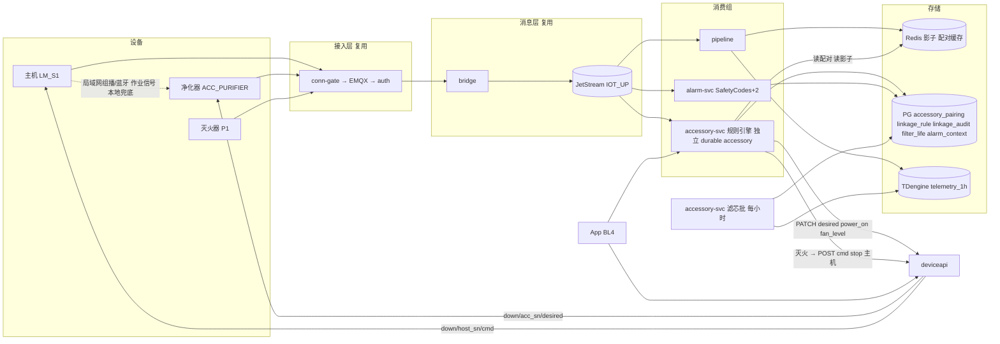

# 配件与安全生态（BL2）技术方案

> Technical Design · BL2 配件与安全生态 · 配对 / 联动规则引擎 / 灭火留痕 / 滤芯寿命

| 项 | 内容 |
|---|---|
| 文档版本 | v0.1 评审稿 · 2026-09-18 |
| 对应 PRD | docs/prd-bl2-accessory-ecosystem.md |
| 上位方案 | docs/tech-design-aiot-platform.md（18 章平台方案，本文只写 BL2 增量） |
| 同级参考 | docs/tech-design-bl4-software-content.md（param-svc / job-svc 的独立消费组与版本发布模式在本文复用） |
| 工程契约 | docs/spec.md；本文新增的服务、表、事件码在评审通过后并入 spec |
| 定位 | 配件是「第二类设备」，不是主机的附属字段。接入、影子、事件、指令、OTA 全部复用；新增的只有配对关系、联动规则引擎、滤芯寿命批计算 |

**四条设计原则**

1. **配件是独立设备**。有自己的 SN、证书、影子、OTA 批次，走同一 MQTT / JetStream 管道。不在主机影子里嵌套配件状态。
2. **本地兜底，云端增强**。净化器跟随主机启停的最低保障由固件本地联动提供；云端规则引擎只做「按材料调档、延时关闭、留痕、统计」。云挂了净化器不能变傻。
3. **关闭比开启更谨慎**。开启是任一路径要求即开；关闭必须云端与本地都允许。规则引擎对关闭只发「建议」，仲裁在配件固件。
4. **安全事件走安全链路**。灭火与烟雾超阈值加入 SafetyCodes，复用 alarm-svc 独立消费组、squelch、状态机、升级，不另起告警通道。

## 目录

1. [边界：复用什么，新建什么](#01-边界复用什么新建什么)
2. [目标与 SLO](#02-目标与-slo)
3. [总体架构](#03-总体架构)
4. [配件接入与配对](#04-配件接入与配对)
5. [联动规则引擎](#05-联动规则引擎)
6. [本地兜底与仲裁](#06-本地兜底与仲裁)
7. [灭火与烟雾安全事件](#07-灭火与烟雾安全事件)
8. [滤芯寿命计算](#08-滤芯寿命计算)
9. [配件 OTA](#09-配件-ota)
10. [数据模型](#10-数据模型)
11. [接口清单](#11-接口清单)
12. [非功能、可观测性与容量](#12-非功能可观测性与容量)
13. [隐私与合规](#13-隐私与合规)
14. [事故预推演摘要](#14-事故预推演摘要)
15. [分步实现](#15-分步实现)
16. [本仓库实现清单](#16-本仓库实现清单)

---

## 01 边界：复用什么，新建什么

| 能力 | 来源 | BL2 的用法 |
|---|---|---|
| 接入调度、认证、ACL、连接许可 | bootstrap-svc / auth-svc / conn-gate（BL1） | 净化器与主机同一套；product_key=ACC_PURIFIER 已在 product 表 |
| 影子 reported / desired、指令、审计 | deviceapi（BL1） | 规则引擎通过 PATCH /desired 下发 power_on / fan_level；灭火事件通过 POST /cmd 让主机 stop |
| 事件流 | bridge → JetStream IOT_UP（BL1） | accessory-svc 作为**新增独立消费组**消费主机 JOB_* / 安全事件与配件事件 |
| 安全告警 | alarm-svc（BL1） | SafetyCodes 加 FIRE_SUPPRESSED、SMOKE_HIGH；告警关联主机走 alarm_context 表 |
| OTA | ota-svc（BL1） | 配件独立 product_key 批次；idle_only 扩展为配对主机也空闲 |
| 遥测明细与降采样 | pipeline / TDengine telemetry_1h（BL1） | 滤芯寿命批的输入 |
| consumable_health | 分片库（BL1 预留，BL3 消费） | 滤芯健康度写 part='filter' |
| 版本化发布纪律 | param-svc（BL4） | 材料档位映射表 linkage_rule 用同样的双人审批与灰度 |
| **accessory-svc**（新，:8092） | 本方案 | 配对管理、联动规则引擎、滤芯寿命批计算、联动审计 |
| 模拟器 -accessory 模式（新） | 本方案 | 模拟净化器：接收 desired、上报运行态与滤芯数据、发安全事件 |

不做的事：不改 Topic 契约，不在主机影子里放配件状态，不在 pipeline 里加 BL2 逻辑。

---

## 02 目标与 SLO

| 维度 | 要求 | 测量点 |
|---|---|---|
| 联动延迟 | 主机事件 recv_ts → 净化器 reported.power_on=true 的影子 updated_at，P99 < 3 s | linkage_audit.created_at 与影子时间戳三段记录 |
| 联动成功率 | ≥ 98%（linkage_enabled 配对） | linkage_audit.result |
| 规则引擎可用性 | 99.9%；不可用时本地兜底接管 | consumer lag、trigger_source=local 比例 |
| 安全事件触达 | FIRE_SUPPRESSED / SMOKE_HIGH P99 < 3 s | 与 BL1 同三段口径 |
| 配对生效 | 配对 / 解除 → 规则引擎感知 ≤ 5 s | Redis 配对缓存写入时间 |
| 滤芯批 | 每小时批 ≤ 5 min；预测误差 ≤ 15% | 批耗时；FILTER_REPLACED 对照 |
| 关闭安全 | 云端「建议关」在本地信号存在时 0 次生效 | 净化器 reported.trigger_source 与 audit 对账 |

---

## 03 总体架构



**关键决策**

| 决策 | 备选 | 理由 |
|---|---|---|
| 规则引擎作为 JetStream 独立消费组 | 在 pipeline 里判断 JOB_START 后直接下发 | pipeline 是吞吐关键路径，且 BL1 原则「不在 pipeline 加业务分支」；独立消费组挂了只影响云端联动，本地兜底仍在 |
| 联动通过 deviceapi PATCH /desired 而不是直接发 MQTT | accessory-svc 自己连 EMQX 发 down/{sn}/desired | desired 的版本单调、PG 持久、离线收敛都在 deviceapi 已实现；复用避免两处写 desired 冲突 |
| 关闭用 desired 建议 + 固件仲裁 | 云端直接 cmd stop 净化器 | 关闭是有风险的动作（作业中断排烟）；仲裁放在离物理世界最近的固件 |
| 配对存分片库 + Redis 缓存 | 只存 Redis | 配对是不可再生的用户意图；Redis 只做规则引擎热路径缓存，5 s TTL 或主动失效 |
| 配件安全码进 SafetyCodes 复用 alarm-svc | 新建 accessory-alarm | 告警状态机、squelch、升级、对账探针一套即可；只加两个码与一张关联表 |
| 滤芯寿命每小时批 | 实时流计算 | 输入是 telemetry_1h 降采样，实时无意义；批可审计可重算 |
| 材料档位映射走 param-svc 发布纪律 | accessory-svc 自己的配置接口 | 映射错了会让净化器档位不对，与参数库同级风险；复用双人审批与灰度 |

---

## 04 配件接入与配对

### 4.1 接入

净化器固件与主机同一套接入纪律（DR-201）：bootstrap → conn-gate → TLS → auth 四步 → ACL。差别只在 product_key 与物模型。device 表 status 流转、device_cert、CF001 代工激活全部复用。

### 4.2 配对模型

```
accessory_pairing(host_sn, acc_sn, acc_type, linkage_enabled, off_delay_s, paired_at, unpaired_at)
部分唯一索引 uk_pairing_active ON (acc_sn) WHERE unpaired_at IS NULL   -- 一台配件同时只配一台主机
索引 (host_sn) WHERE unpaired_at IS NULL                                  -- 一台主机多配件
```

- **配对**：App 调 `POST /api/v1/pairings {host_sn, acc_sn}`（BFF 已校验用户对两台设备都有 owner 绑定）。事务内：若 acc_sn 有有效配对且 host 不同 → 先 unpaired_at=now() 再 INSERT；相同 → 幂等返回。
- **解除**：`DELETE /api/v1/pairings/{id}` → unpaired_at=now()。
- **传导**：主机解绑（device_binding.unbound_at 写入）时同事务 UPDATE 该 host_sn 的全部有效配对 unpaired_at=now()。deviceapi 的解绑接口需调用 accessory-svc 或直接执行 SQL；原型用 PG 触发器 `trg_binding_unpair`（见 §16 DDL）避免跨服务事务。
- **配件回报**：配对成功后向配件 desired 写 `paired_sn=host_sn`，配件回报后 reported.paired_sn 可用于本地兜底过滤（只响应配对主机的广播）。

### 4.3 规则引擎的配对缓存

Redis `pairing:host:{host_sn}` → JSON [{acc_sn, acc_type, linkage_enabled, off_delay_s}]，TTL 60 s，配对变更时主动 DEL。规则引擎热路径只读 Redis，miss 回源 PG 并回填。

---

## 05 联动规则引擎

### 5.1 输入与输出

```
输入（JetStream IOT_UP，durable "accessory"，FilterSubjects iot.up.event.* 与 iot.up.telemetry.*）
  主机事件：JOB_START(material_id) / JOB_DONE / JOB_FAIL / JOB_PAUSE / 安全码
  主机遥测：work_state 变化（telemetry 量大，只在 work_state 与上次影子不同才处理）
  配件事件：FIRE_SUPPRESSED / SMOKE_HIGH / FILTER_REPLACED
输出
  deviceapi PATCH /api/v1/devices/{acc_sn}/desired {power_on, fan_level}
  deviceapi POST /api/v1/devices/{host_sn}/cmd {action: stop, source: system}（仅灭火事件）
  linkage_audit 一行
```

### 5.2 规则表（P0 固定规则，P2 才做 DSL）

| 触发 | 条件 | 动作 | 说明 |
|---|---|---|---|
| 主机 JOB_START | 配对且 linkage_enabled | 取消该配件的待关闭定时器；desired {power_on:true, fan_level: LevelFor(material_id)} | LevelFor 查 linkage_rule，无映射用默认 2 |
| 主机 work_state → 2 | 同上，且最近 10 s 无 JOB_START 已处理 | 同上（用默认档） | 兜住没有 JOB 元数据的老固件 |
| 主机 JOB_DONE / JOB_FAIL / work_state → 0 | 配对且 linkage_enabled | 启动定时器 off_delay_s 后 desired {power_on:false}；期间再有 JOB_START 取消 | 关闭只是建议，固件仲裁 |
| 主机安全码（FLAME_DETECTED / OVER_TEMP …） | 配对（不看 linkage_enabled） | desired {power_on:true, fan_level:4}，10 min 后回到普通规则 | 排烟优先，用户关闭联动也执行 |
| 配件 FIRE_SUPPRESSED | 配对 | 主机 POST /cmd stop（source=system, operator=accessory-svc）；同主机其它净化器 fan_level 4 | 第二道停机，见 §7 |
| 配件 SMOKE_HIGH | 配对 | 该配件 fan_level 4；不停主机 | 烟雾超阈值不等于火 |

### 5.3 定时器与幂等

- 待关闭定时器存 Redis `linkage:off:{acc_sn}` = 到期时间，规则引擎每秒扫描到期键（ZSET `linkage:off` score=到期 Unix 秒）。进程重启不丢；多副本用 ZPOPMIN 抢占。
- 幂等：同一 (host_sn, acc_sn, trigger, seq) 只处理一次，Redis SETNX `linkage:seen:{host_sn}:{seq}` TTL 600 s，与 pipeline dedupe 同法但独立 key 空间。
- 下发失败（deviceapi 5xx）：重试 3 次退避后写 audit result=failed，不 Nak（本地兜底已在，重放没有意义）。

### 5.4 纯函数

- `LevelFor(rules map[material]level, materialID string, def int) int`
- `Decide(evt Event, pairings []Pairing, state EngineState) []Action`：规则表的代码形态，表驱动单测覆盖全部行。
- `ShouldCancelOff(lastStart, offDue time.Time) bool`

---

## 06 本地兜底与仲裁

### 6.1 主机作业信号

主机固件在 work_state=2 期间每 2 s 广播一次作业信号（局域网 UDP 组播 239.x.x.x:port 或蓝牙广播，二选一或双发），载荷 `{host_sn, work_state, ts}` 带 HMAC（密钥为配对时云端下发的 pair_key，防邻居误触发）。停止广播 30 s 视为作业结束。

### 6.2 净化器仲裁（DR-203）

```
want_on   = cloud.power_on || local.signal_active || manual.on
fan_level = max(cloud.fan_level, local.default_level, manual.level)
可以关闭  = !cloud.power_on && !local.signal_active && !manual.on
trigger_source = 谁最先要求开机（cloud / local / manual）
```

云端「建议关」在本地信号仍存在时不生效。这是 PRD 风险表第一条的落地：规则引擎 bug 不可能导致作业中无排烟。

### 6.3 云端对兜底的观测

reported.trigger_source=local 的启动次数占比进看板。占比升高意味着云端联动慢或规则引擎不可用，是 INC-2-01 的检测信号。

---

## 07 灭火与烟雾安全事件

### 7.1 事件码

envelope.SafetyCodes 新增 `FIRE_SUPPRESSED`、`SMOKE_HIGH`。alarm-svc 无需改状态机；level 均为 critical。SMOKE_HIGH 分两档由**配件固件**判定：高档上报 SMOKE_HIGH（安全码），低档上报 `SMOKE_ELEVATED`（非安全码，走非安全提醒）。

### 7.2 关联主机

alarm-svc 建告警后，accessory-svc 消费同一事件，查配对与主机影子，写 `alarm_context(alarm_id?, acc_sn, host_sn, host_work_state, job_id, created_at)`。因 alarm_id 由 alarm-svc 生成、两个消费组异步，关联键用 (acc_sn, code, event_ts)，App 查询时 JOIN。

### 7.3 主机停机第二道

FIRE_SUPPRESSED → accessory-svc 调 deviceapi `POST /cmd {action: stop}`，source=system。主机端侧火焰检测通常已先停机，这是冗余；cmd_audit 记录 operator=accessory-svc，用户在审计页可见「系统因灭火事件停机」。开放问题 3 若确认不需要，只需关一个开关 `IOT_ACC_STOP_HOST_ON_FIRE`。

---

## 08 滤芯寿命计算

### 8.1 模型

```
每小时批，对每个 acc_sn：
  Δvolume = Σ_档位 (run_seconds_at_level × flow_coeff[level]) × pressure_factor
  pressure_factor = 1 + max(0, (pressure_diff - p0) / p_span) × k_p     -- 压差越大堵得越快
  eq_air_volume += Δvolume
  health = clamp(1 - eq_air_volume / rated_volume, 0, 1)
  predicted_eol_at = now + (rated_volume - eq_air_volume) / 近 7 天日均 Δvolume
```

- flow_coeff、p0、p_span、k_p、rated_volume 按滤芯型号配置在 `filter_model` 表，由实验室 3 组对照标定。
- 输入：telemetry_1h 中该 acc_sn 的 run_seconds 增量与 fan_level 分布（需在 telemetry_1h 流增加 last(run_seconds)、avg(pressure_diff)、fan_level 直方图；原型用明细表按小时聚合）。
- FILTER_REPLACED 事件或 desired filter_reset → eq_air_volume 清零，installed_at 更新。

### 8.2 输出

- filter_life 表更新；同事务 UPSERT consumable_health(sn=acc_sn, part='filter', health×100, used_hours, predicted_eol_at)。
- 阈值提醒由 BL3 / BL4 按 consumable_health 消费，accessory-svc 不发推送（职责边界）。

### 8.3 纯函数

`FilterStep(prev State, hour HourAgg, cfg FilterModel) State`、`PredictEOL(state, dailyAvg) time.Time`，表驱动单测覆盖压差折损、清零、日均为 0 时的 EOL 处理。

---

## 09 配件 OTA

- 净化器固件登记与批次完全走 ota-svc：product_key=ACC_PURIFIER，独立灰度档位与熔断计数。
- idle_only 扩展：ota-svc 下发前除了配件自身 work_state 空闲，还查配对主机影子 work_state=0（accessory-svc 提供 `GET /internal/pairings/by-acc/{acc_sn}` 或 ota-svc 直接查 PG 配对表）。原型用 PG 查询，不引入服务间调用。
- stale 判定、绝对数熔断、档位顺序等 BL1 一轮已实现的护栏自动生效。

---

## 10 数据模型

### 10.1 分片库 iot_shard 新增

| 表 | 关键列 | 约束 / 说明 |
|---|---|---|
| accessory_pairing | id, host_sn, acc_sn, acc_type, linkage_enabled bool default true, off_delay_s int default 180, pair_key char(64), paired_at, unpaired_at | uk_pairing_active (acc_sn) WHERE unpaired_at IS NULL；ck off_delay_s BETWEEN 60 AND 600 |
| linkage_audit | id, host_sn, acc_sn, trigger, action JSONB, result, latency_ms, created_at | RANGE 按月分区，复用 ensure 分区函数模式 |
| alarm_context | id, acc_sn, code, event_ts, host_sn, host_work_state, job_id, created_at | 索引 (acc_sn, code, event_ts) |
| filter_life | acc_sn PK, filter_model, installed_at, eq_air_volume numeric, health numeric(5,4), predicted_eol_at, last_hour timestamptz, updated_at | health 同步写 consumable_health |

### 10.2 全局库 iot_global 新增

| 表 | 关键列 | 说明 |
|---|---|---|
| linkage_rule | product_key, material_id, fan_level smallint, version bigint, PK(product_key, material_id, version) | 材料档位映射；发布走 param_release 同款约束（可直接复用 param_release 的 version 序列：product_key=ACC_PURIFIER） |
| filter_model | model PK, rated_volume, flow_coeff JSONB {level: coeff}, p0, p_span, k_p, version | 滤芯型号系数 |

### 10.3 物模型：ACC_PURIFIER v1

见 PRD §6.1。影子 reported 新字段随 pipeline 属性透传（BL4 一轮已实现 ExtractTelemetryExtras）进入 shadow:{acc_sn}，无需改 pipeline。

### 10.4 事件码

envelope.SafetyCodes += FIRE_SUPPRESSED, SMOKE_HIGH。非安全码 SMOKE_ELEVATED、FILTER_REPLACED 由 pipeline 正常落 events。

### 10.5 Redis

| Key | 用途 | TTL |
|---|---|---|
| pairing:host:{host_sn} | 配对缓存 | 60 s，变更主动删 |
| linkage:off（ZSET） | 待关闭定时器 | 无 |
| linkage:seen:{host_sn}:{seq} | 规则幂等 | 600 s |
| linkage:safety:{acc_sn} | 安全排烟 10 min 窗口 | 600 s |

---

## 11 接口清单

accessory-svc :8092，用户归属校验由 BFF 做，服务只认 X-User-Id 透传。

| 方法 路径 | 用途 | 阶段 |
|---|---|---|
| POST /api/v1/pairings {host_sn, acc_sn, acc_type} | 配对（幂等；换主机自动解除旧配对） | P0 |
| DELETE /api/v1/pairings/{id} | 解除 | P0 |
| GET /api/v1/pairings?host_sn= 或 ?acc_sn= | 查询 | P0 |
| PATCH /api/v1/pairings/{id} {linkage_enabled?, off_delay_s?} | 联动开关与延时 | P0 |
| GET /api/v1/devices/{host_sn}/linkage-audit?limit= | 联动留痕 | P0 |
| GET /api/v1/alarms/{acc_sn}/context?code=&event_ts= | 配件告警关联主机信息 | P0 |
| GET /api/v1/devices/{acc_sn}/filter | 滤芯健康度与预测 | P1 |
| POST /internal/filter/run-once | 手动触发滤芯批 | P1 |
| GET /healthz · GET /metrics | 健康与指标 | P0 |

---

## 12 非功能、可观测性与容量

### 12.1 容量

| 项 | 估算 |
|---|---|
| 配件数 | 主机 1000 万 × 连带 25% = 250 万，在线率同主机 30% → 75 万并发 |
| 配件心跳 | 空闲 120 s：约 6000 msg/s；运行态 0.2 Hz 按 10% → 1.5 万 msg/s；合计比主机遥测增加约 8% |
| 规则引擎输入 | 主机 JOB 事件约 420/s（BL4 估算）+ work_state 变化，远低于遥测；telemetry 过滤在消费端按影子比对，需 Redis 读约 6 万/s（300 万在线主机 × 0.2 Hz × 10% 作业），可接受；生产可让 pipeline 发 work_state 变化事件到独立 subject 降低读量 |
| linkage_audit | 每日约 3600 万 × 2（开关）行，按月分区 180 天，需与 cmd_audit 同样的分区滚动 |
| 滤芯批 | 250 万 acc_sn 每小时一次聚合，TDengine 按 tbname 聚合分钟级 |

### 12.2 看板

| 看板 | 指标 |
|---|---|
| 联动 | 触发数 / 成功 / 失败、延迟直方图、trigger_source 分布、待关闭定时器数、取消关闭数、consumer lag |
| 配对 | 有效配对数、连带率、配对变更数、缓存命中 |
| 安全 | FIRE_SUPPRESSED / SMOKE_HIGH 数、关联成功率、主机 stop 下发数 |
| 滤芯 | 批耗时、health 分布、≤20% 设备数、预测误差（有 FILTER_REPLACED 对照的） |

---

## 13 隐私与合规

- 配件遥测与事件只含 acc_sn；配对表只含 host_sn 与 acc_sn；用户关联仍只经主机 device_binding。
- 主机解绑传导配对解除（触发器），转让后原 owner 不再能通过配对影响配件。
- 灭火事件留痕长期保留用于安全复核，不含用户身份。
- 本地联动广播的 pair_key 由云端在配对时下发给双方，不在遥测中出现。

---

## 14 事故预推演摘要

详见 docs/incident-premortem-bl2.md。BL2 特有事故中级别最高的四条：

| ID | 事故 | 级别 | 一句话止血 |
|---|---|---|---|
| INC-2-03 | 云端建议关被固件错误采纳，作业中净化器停转 | S1 | 关闭规则全局开关，仅保留开启；固件仲裁修复前云端不发 power_on:false |
| INC-2-07 | 灭火事件未推送或未关联主机 | S1 | 复用 BL1 INC-10 处置；关联缺失走对账补录 |
| INC-2-09 | 灭火事件误触发主机 stop 打断正常作业 | S2 | 关 IOT_ACC_STOP_HOST_ON_FIRE |
| INC-2-14 | 滤芯寿命系数错误导致全量提前提醒 | S2 | filter_model 回滚版本，重算 health |

---

## 15 分步实现

| 迭代 | 交付 | 验收 |
|---|---|---|
| 1 | sql/bl2.sql；accessory-svc 配对接口与缓存；规则引擎 JOB_START / DONE / work_state 三条规则 + 定时关闭 + 审计；模拟器 -accessory 模式（净化器接收 desired、回报、trigger_source）；smoke 增加「主机开始作业 → 净化器 power_on」 | 50 + 50 模拟配对，联动延迟 P99 < 3 s，关闭延时与取消正确 |
| 2 | SafetyCodes 加两码；alarm_context 富化；FIRE_SUPPRESSED → 主机 stop（开关）；安全排烟规则；linkage_rule 材料档位（复用 param-svc 发布） | 模拟器发 FIRE_SUPPRESSED → 告警 + 关联 + 主机收到 stop，P99 < 3 s |
| 3 | 滤芯批：filter_model、filter_life、consumable_health 写入；模拟器上报 run_seconds / pressure_diff；GET /filter | 实验室对照数据回放误差 ≤ 15% |
| 4 | 配件 OTA idle_only 扩展；linkage_audit 分区滚动；看板 | 主机作业中配件不升级 |

---

## 16 本仓库实现清单

下一阶段写代码直接按此清单执行。

### 16.1 新服务 accessory-svc

- `cmd/accessory-svc/main.go`（:8092，IOT_HTTP_ADDR），`internal/accessory/`：
  - `pairing.go`：Store 接口 + PGStore（Pair / Unpair / List / Update / ByHost / ByAcc），Redis 缓存 `pairing:host:{sn}`。
  - `rules.go`：纯函数 `LevelFor`、`Decide(evt, pairings, state) []Action`、`ShouldCancelOff`；规则表驱动单测。
  - `engine.go`：JetStream durable `accessory`，FilterSubjects `iot.up.event.*` + `iot.up.telemetry.*`；telemetry 只处理 work_state 与影子不同的帧；幂等 `linkage:seen`；动作执行器调 deviceapi（HTTP 客户端，IOT_DEVICEAPI_URL 默认 http://127.0.0.1:8083）；失败重试 3 次后 audit failed。
  - `offtimer.go`：Redis ZSET `linkage:off` 定时器，`RunOffTimer` 每秒 ZPOPMIN 到期项 → desired power_on:false。
  - `context.go`：消费配件安全事件写 alarm_context；`IOT_ACC_STOP_HOST_ON_FIRE`（默认 true）时对主机 POST /cmd stop。
  - `filter.go`：纯函数 `FilterStep`、`PredictEOL`；`RunFilterBatch` 每小时（IOT_ACC_FILTER_INTERVAL 默认 1h）从 TDengine 按 acc_sn 聚合上一小时 → filter_life + consumable_health。
  - `handler.go`：§11 接口；`metrics.go`：linkage_triggered / succeeded / failed / latency 分位、off_scheduled / off_cancelled / off_sent、pairings_active、context_written、host_stop_sent、filter_batch_runs / devices / errors。
- 集成测试（IOT_IT）：配对 → 发 JOB_START 信封 → 净化器 desired 被写（查 PG shadow_desired）→ JOB_DONE → 定时器到期（off_delay_s 测试用 1 s）→ desired power_on=false；FIRE_SUPPRESSED → alarm_context 有行且 cmd_audit 有 stop。

### 16.2 DDL：sql/bl2.sql（compose 挂为 05-bl2.sql）

```sql
SET search_path TO iot_shard;
CREATE TABLE IF NOT EXISTS accessory_pairing (
  id BIGINT GENERATED ALWAYS AS IDENTITY PRIMARY KEY,
  host_sn VARCHAR(32) NOT NULL, acc_sn VARCHAR(32) NOT NULL, acc_type VARCHAR(16) NOT NULL,
  linkage_enabled BOOLEAN NOT NULL DEFAULT true,
  off_delay_s INT NOT NULL DEFAULT 180 CHECK (off_delay_s BETWEEN 60 AND 600),
  pair_key CHAR(64) NOT NULL,
  paired_at TIMESTAMPTZ NOT NULL DEFAULT now(), unpaired_at TIMESTAMPTZ
);
CREATE UNIQUE INDEX IF NOT EXISTS uk_pairing_active ON accessory_pairing(acc_sn) WHERE unpaired_at IS NULL;
CREATE INDEX IF NOT EXISTS idx_pairing_host ON accessory_pairing(host_sn) WHERE unpaired_at IS NULL;

CREATE TABLE IF NOT EXISTS linkage_audit (
  id BIGINT GENERATED ALWAYS AS IDENTITY, host_sn VARCHAR(32) NOT NULL, acc_sn VARCHAR(32) NOT NULL,
  trigger VARCHAR(32) NOT NULL, action JSONB NOT NULL, result VARCHAR(16) NOT NULL, latency_ms INT,
  created_at TIMESTAMPTZ NOT NULL DEFAULT now(), PRIMARY KEY (id, created_at)
) PARTITION BY RANGE (created_at);
-- 分区滚动函数与 cmd_audit 同模式：ensure_linkage_audit_partitions(months_ahead)

CREATE TABLE IF NOT EXISTS alarm_context (
  id BIGINT GENERATED ALWAYS AS IDENTITY PRIMARY KEY, acc_sn VARCHAR(32) NOT NULL, code VARCHAR(32) NOT NULL,
  event_ts TIMESTAMPTZ NOT NULL, host_sn VARCHAR(32), host_work_state SMALLINT, job_id CHAR(36),
  created_at TIMESTAMPTZ NOT NULL DEFAULT now()
);
CREATE INDEX IF NOT EXISTS idx_alarm_context ON alarm_context(acc_sn, code, event_ts);

CREATE TABLE IF NOT EXISTS filter_life (
  acc_sn VARCHAR(32) PRIMARY KEY, filter_model VARCHAR(32) NOT NULL, installed_at TIMESTAMPTZ NOT NULL,
  eq_air_volume NUMERIC(14,2) NOT NULL DEFAULT 0, health NUMERIC(5,4) NOT NULL DEFAULT 1,
  predicted_eol_at TIMESTAMPTZ, last_hour TIMESTAMPTZ, updated_at TIMESTAMPTZ NOT NULL DEFAULT now()
);

-- 主机解绑 → 配对解除（跨服务事务用触发器代替）
CREATE OR REPLACE FUNCTION iot_shard.trg_binding_unpair() RETURNS trigger LANGUAGE plpgsql AS $$
BEGIN
  IF NEW.unbound_at IS NOT NULL AND OLD.unbound_at IS NULL THEN
    UPDATE iot_shard.accessory_pairing SET unpaired_at = NEW.unbound_at WHERE host_sn = NEW.sn AND unpaired_at IS NULL;
  END IF;
  RETURN NEW;
END $$;
DROP TRIGGER IF EXISTS binding_unpair ON iot_shard.device_binding;
CREATE TRIGGER binding_unpair AFTER UPDATE OF unbound_at ON iot_shard.device_binding
  FOR EACH ROW EXECUTE FUNCTION iot_shard.trg_binding_unpair();

SET search_path TO iot_global;
CREATE TABLE IF NOT EXISTS linkage_rule (
  product_key VARCHAR(32) NOT NULL, material_id VARCHAR(32) NOT NULL, fan_level SMALLINT NOT NULL CHECK (fan_level BETWEEN 1 AND 4),
  version BIGINT NOT NULL, PRIMARY KEY (product_key, material_id, version)
);
CREATE TABLE IF NOT EXISTS filter_model (
  model VARCHAR(32) PRIMARY KEY, rated_volume NUMERIC(14,2) NOT NULL, flow_coeff JSONB NOT NULL,
  p0 NUMERIC(8,2) NOT NULL DEFAULT 50, p_span NUMERIC(8,2) NOT NULL DEFAULT 100, k_p NUMERIC(6,4) NOT NULL DEFAULT 0.5,
  version INT NOT NULL DEFAULT 1
);
INSERT INTO filter_model(model, rated_volume, flow_coeff) VALUES ('HEPA-STD', 3600000, '{"1":60,"2":120,"3":200,"4":300}') ON CONFLICT DO NOTHING;
```

### 16.3 物模型与事件码

- `internal/pkg/envelope`：SafetyCodes 加 `FIRE_SUPPRESSED`、`SMOKE_HIGH`（alarm-svc 自动生效，level critical）。
- 影子：净化器 reported 字段 power_on / fan_level / fan_rpm / run_seconds / pressure_diff / filter_installed_at / trigger_source / paired_sn 随 telemetry 属性透传（BL4 一轮的 ExtractTelemetryExtras 已支持标量未知字段；确认 bool 与 string 都能进影子）。

### 16.4 模拟器 -accessory 模式

- `device-simulator -accessory purifier -n 50 -pair-with SIM` ：SN 前缀 ACC，product_key ACC_PURIFIER；上线报 power_on:false、fan_level:0、trigger_source:manual、run_seconds、pressure_diff（缓慢上升）；订阅 down/{sn}/desired，收到 power_on / fan_level 后 1 s 内回报 reported 并置 trigger_source=cloud；`-acc-event FIRE_SUPPRESSED@30s` 注入安全事件；`-local-signal`（模拟本地兜底：主机模拟器作业态时净化器自行开启，trigger_source=local）。
- 主机模拟器：JOB_START 已带 material_id（BL4 一轮），无需改。

### 16.5 需要改动的现有服务

| 服务 | 改动 |
|---|---|
| envelope | SafetyCodes 加两码 |
| deviceapi | 无接口改动；desired PATCH 需接受 operator/source 头用于审计（可选） |
| ota-svc | pendingTasks 圈选时对 product_key=ACC_* 的设备额外检查配对主机影子 work_state=0（P1，可后置） |
| pipeline | 无（属性透传已支持） |
| scripts/smoke.sh | 增加：起 50 台净化器并配对 → 主机 JOB_START 后 15 s 内净化器 shadow.reported.power_on == true → JOB_DONE 后 off_delay（测试用 5 s）内变 false |
| deploy/docker-compose.yml | 挂 sql/bl2.sql 为 05-bl2.sql |
| docs/spec.md | §3 SafetyCodes、§6 accessory-svc 行、模拟器 flag |

### 16.6 环境变量

IOT_HTTP_ADDR(:8092)、IOT_DEVICEAPI_URL、IOT_ACC_OFF_DELAY_DEFAULT(180s)、IOT_ACC_STOP_HOST_ON_FIRE(true)、IOT_ACC_FILTER_INTERVAL(1h)、IOT_ACC_SAFETY_VENT(10m)。

---

## 附录 A · PRD 需求对照

| PRD 需求 | 本方案章节 |
|---|---|
| FR-201 到 FR-204 接入与配对 | §4、§10.1 |
| FR-211 到 FR-217 云端联动 | §5、§16.1 |
| FR-221 到 FR-223 本地兜底 | §6 |
| FR-231 到 FR-235 安全事件 | §7、§10.4 |
| FR-241 到 FR-245 滤芯寿命 | §8、§10.2 |
| FR-251 / FR-252 配件 OTA | §9 |
| DR-201 到 DR-208 | §6、§16.4 |
| §6 数据需求 | §10 |
| §7 非功能 | §2、§12 |
| §10 风险 | §14 |

---

*BL2 技术方案 v0.1 · 配件是第二类设备，复用 BL1 五条链路；新增 accessory-svc 一个服务、sql/bl2.sql 六张表、两个安全码。本地兜底与「关闭比开启更谨慎」是本文不可协商的两条约束。*
