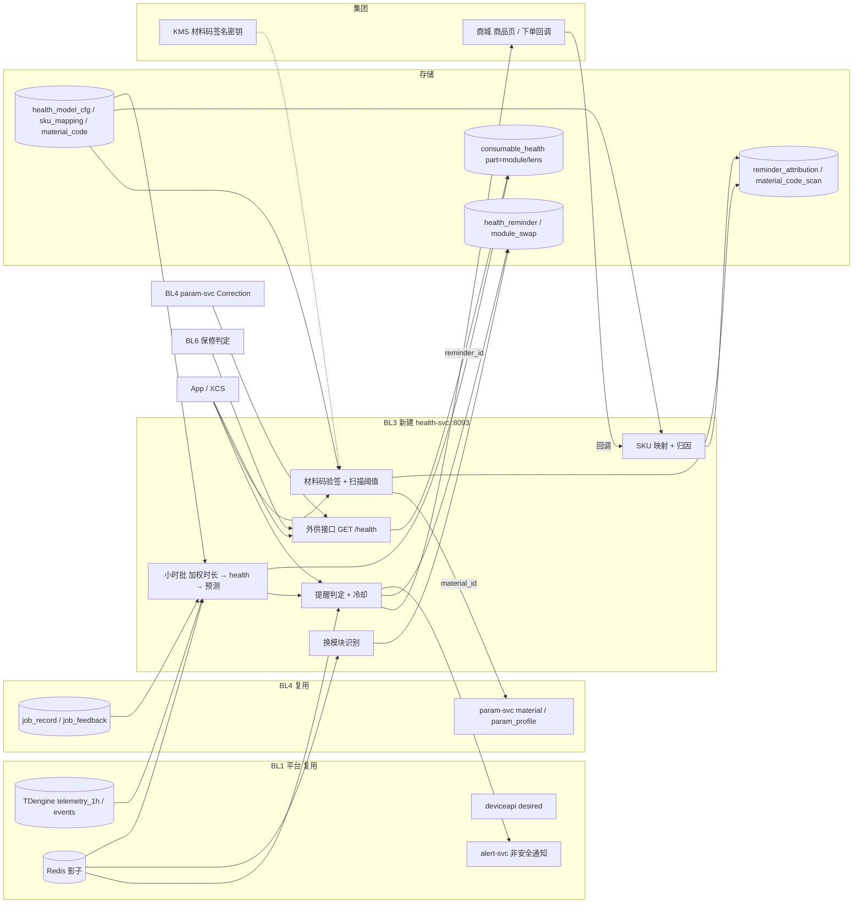

# 耗材与材料（BL3）技术方案

> Technical Design · BL3 耗材与材料 · 健康度 / 提醒 / 归因 / 材料识别与防伪

| 项 | 内容 |
|---|---|
| 文档版本 | v0.1 评审稿 · 2026-09-18 |
| 对应 PRD | docs/prd-bl3-consumables-materials.md |
| 上位方案 | docs/tech-design-aiot-platform.md（18 章平台方案）；docs/tech-design-bl4-software-content.md（BL3 的 health 是 BL4 §9.1 校正系数的输入，材料带参数复用 BL4 param-svc） |
| 工程契约 | docs/spec.md；本文新增服务与接口评审通过后并入 spec |
| 定位 | BL3 不建新的设备链路，是纯消费侧业务：读 BL1 已有的 telemetry_1h、events、影子，产出 health 与提醒；材料识别是参数入口，复用 BL4 |

**四条设计原则**

1. **消费不生产**。不改 Topic、不加设备到云的通道；唯一的设备侧新增是可选的 module_hours 与 LENS_CLEANED 事件，且全部走既有 telemetry / event 通道。
2. **缺失不写 0**。任何输入缺失（telemetry_1h 无行、module_model 未知、配置缺失）都跳过该设备并计数，绝不产出一个「health=0 需更换」的假结论。批作业缺失率超阈值整体熔断。
3. **口径版本化可回溯**。权重、额定时长、惩罚系数存 health_model_cfg 并带 version；consumable_health 写入携带 model_version；任何一次 health 都能用当时的配置复算出来。
4. **提醒不打扰、不越界**。冷却 7 天、作业中不弹、可关闭；提醒走 alert-svc 非安全通道，health-svc 故障或用户关闭提醒对安全告警与基础控制零影响。

## 目录

1. [边界：复用什么，新建什么](#01-边界复用什么新建什么)
2. [目标与 SLO](#02-目标与-slo)
3. [总体架构](#03-总体架构)
4. [健康度模型](#04-健康度模型)
5. [小时级批计算](#05-小时级批计算)
6. [换模块识别与预测](#06-换模块识别与预测)
7. [提醒判定、冷却与通知](#07-提醒判定冷却与通知)
8. [SKU 映射与下单归因](#08-sku-映射与下单归因)
9. [材料识别与防伪](#09-材料识别与防伪)
10. [镜片污染启发式（P2）](#10-镜片污染启发式p2)
11. [数据模型](#11-数据模型)
12. [接口清单](#12-接口清单)
13. [非功能、可观测性与容量](#13-非功能可观测性与容量)
14. [隐私与合规](#14-隐私与合规)
15. [事故预推演摘要](#15-事故预推演摘要)
16. [本仓库实现清单](#16-本仓库实现清单)

---

## 01 边界：复用什么，新建什么

| 能力 | 来源 | BL3 的用法 |
|---|---|---|
| telemetry_1h（last(laser_hours)、avg/max temp） | BL1 TDengine 流 | 加权时长的主输入；需在流中**新增功率档分布列** |
| events（OVER_TEMP、JOB_*、LENS_CLEANED） | BL1 TDengine | 事件惩罚、镜片启发式、更换校准 |
| 影子 reported（module_model、work_state、laser_hours） | BL1 Redis | 换模块识别、提醒时机、laser_hours 兜底 |
| consumable_health | BL1 分片库（已建表） | part=module / lens 由本文写；part=filter 留给 BL2；**不改结构** |
| desired 下发 | BL1 deviceapi | consumable_notify_optout 开关 |
| 非安全通知通道 | BL1 alert-svc | 三档提醒推送 |
| param-svc（material、param_profile） | BL4 | 材料码 → material_id → 参数档 |
| job_record / job_feedback | BL4 | 识别记录、镜片启发式 |
| **health-svc**（新，:8093） | 本方案 | 小时批、换模块识别、预测、提醒判定与冷却、外供接口、SKU 映射与归因、材料码验签与扫描阈值 |
| 集团电商 / KMS | 集团 | SKU 与订单回调；材料码签名密钥 |

不做的事：不改 pipeline；不在设备端计算 health（设备只上报原始量）；不做商城、库存与支付。

---

## 02 目标与 SLO

| 维度 | 要求 | 测量点 |
|---|---|---|
| 批作业时长 | 每小时一次，P95 < 10 min 全量 | health-svc batch_duration_seconds |
| 健康度新鲜度 | updated_at ≤ 3 h 的设备 ≥ 99% | consumable_health 扫描 |
| 缺失率 | 单轮缺输入设备 < 5%；> 20% 熔断不写 | batch_skipped_missing / batch_total |
| 外供接口 | GET /health/{sn} P99 < 50 ms，可用 99.9% | HTTP 直方图 |
| 提醒 | 判定到推送 P95 < 5 min；冷却 100% 生效；作业中 0 推送 | health_reminder.sent_at 与 suppressed_reason |
| 材料码验签 | P99 < 100 ms | HTTP 直方图 |
| 归因 | 回调落库 P99 < 10 s；与商城对账差 < 1% | 每日对账任务 |
| 安全隔离 | 停 health-svc 跑 BL1 冒烟五步必须全过 | 集成测试 |

---

## 03 总体架构



**关键决策**

| 决策 | 备选 | 理由 |
|---|---|---|
| health 在云端小时批计算 | 设备端实时计算 | 口径要能改、能回溯、能跨设备校准；设备只报原始量，固件零改动 |
| 小时批而非流式 | 流计算 | 输入本来就是小时级降采样；每小时一次足够，且批处理便于缺失率熔断与幂等重算 |
| 缺失不写 0 + 批级熔断 | 缺失按 0 处理 | 「health=0」是最贵的误报（触发更换提醒与购买）；宁可陈旧不可错误 |
| 提醒走 alert-svc 非安全通道 | 复用 alarm-svc | 耗材提醒可关、可冷却、可延后，与安全告警的「不可关、立即、升级」语义完全相反，必须物理隔离 |
| 归因以 reminder_id 为主键、商城回调为数据源 | 用户点击埋点 | 点击不等于购买；商城回调是唯一的成交事实来源，点击只做漏斗中间环节 |
| 材料码云端验签 + 客户端格式校验 | 纯客户端验签 | 客户端持有验签公钥即可被逆向批量生成合规格式；云端验签加同码多账号阈值才能识别复制码 |

---

## 04 健康度模型

### 4.1 加权发光时长

```
对设备 sn 的每个小时桶 h（来自 telemetry_1h）：
  Δhours_h   = laser_hours_h − laser_hours_{h−1}       （<0 或 > 1.0 视为异常，见 §6）
  share_low  = 该小时 power_level ≤ 50 的采样占比
  share_mid  = 51..80 占比
  share_high = > 80 占比                                （三者由流新增列给出，缺失时用该小时 avg(power_level) 落到的单档 = 1.0）
  weighted_h = Δhours_h × (share_low × w_low + share_mid × w_mid + share_high × w_high)

used_weighted = Σ weighted_h（自上次更换起）
```

默认权重 w_low=1.0、w_mid=1.3、w_high=1.8，额定加权时长 rated_weighted_hours 按 product_key × module_model 配置（如 LM40 为 10000 h）。全部来自 health_model_cfg，带 version。

### 4.2 健康度

```
base    = 100 × (1 − used_weighted / rated_weighted_hours)
penalty = min(overtemp_penalty × overtemp_count_since_swap, 10)      默认 overtemp_penalty=0.5
health  = clamp(base − penalty, 0, 100)
```

- health **单调不增**：新值 > 旧值 且非更换场景 → 保留旧值并计数 `health_nonmonotonic`（说明输入回退或配置变化）。
- 配置版本变化时允许一次重算导致的上升，记录 reason=cfg_change。

### 4.3 可解释输出

每次写入同时产出解释：`{used_weighted, rated, share:{low,mid,high}, overtemp_count, penalty, model_version}` 存 consumable_health 的伴随表 health_explain（或 JSONB 列，见 §11），供 App「为什么是 62 分」与 BL6 保修争议使用。

---

## 05 小时级批计算

### 5.1 流程

```
每小时 :05 触发（IOT_HEALTH_INTERVAL 1h，错开 telemetry_1h 窗口关闭）
  1 圈选：过去 24 h 有 telemetry_1h 行的 SN（TDengine：SELECT DISTINCT tbname FROM iot.telemetry_1h WHERE ts > now-24h）
  2 逐 SN（并发 IOT_HEALTH_WORKERS 默认 8）：
     a 读配置：影子 reported.module_model → health_model_cfg(product_key, module_model)；缺 → skip(missing_cfg)
     b 读增量：自 consumable_health.updated_at（或上次更换）以来的 telemetry_1h 行；无行 → skip(no_rows)
     c 换模块识别（§6）→ 若更换：重置累计、写 module_swap
     d 累计 used_weighted、overtemp_count（events 查询同窗口）
     e 计算 health、predicted_eol_at；单调性检查
     f UPSERT consumable_health(sn,'module') 与 health_explain；带 model_version
  3 缺失率熔断：本轮 skipped / total > IOT_HEALTH_MISSING_FUSE(0.2) → 整轮回滚不写，告警 batch_fused
  4 提醒判定（§7）只对本轮成功更新的 SN 执行
```

### 5.2 幂等与增量

- 累计量存 consumable_health.used_hours（存 used_weighted，字段复用，注释说明）与 health_explain.last_bucket_ts；每轮只读 last_bucket_ts 之后的小时桶，重跑同一小时幂等（桶 ts 严格大于）。
- 全量重算（配置变化或口径修复）用 `health-svc recompute --sn/--product_key --since`，从 module_swap 或首条 telemetry_1h 起重放，写入时 reason=recompute。

### 5.3 输入异常处理

| 异常 | 处理 |
|---|---|
| Δhours < 0 | 可能是换模块或固件重置 → 交 §6 判定；未判定为更换则该桶跳过并计数 hours_regress |
| Δhours > 1.0 h / 桶 | 上报异常 → 截断为 1.0 并计数 hours_clipped |
| module_model 缺失 | skip(missing_model)；P0 手选值也在影子里，仍缺才 skip |
| 配置缺失 | skip(missing_cfg)，看板按 product_key × module_model 列出缺配置组合 |
| TDengine 不可用 | 整轮失败重试 3 次后放弃，下小时再来；不写任何值 |

---

## 06 换模块识别与预测

### 6.1 识别规则（纯函数 DetectSwap）

| 信号 | 判定 |
|---|---|
| 影子 module_model 与上次记录不同 | 更换，reason=model_change |
| laser_hours 回落到 < 5% 上次值且持续 ≥ 2 个小时桶 | 更换，reason=hours_reset（单桶回落可能是乱序） |
| 用户在 App 点「已更换」 | 记 user_marked，等待上述任一信号在 24 h 内确认；未确认则提示「未检测到更换」 |
| module_hours（DR-303，可选）从设备上报且远小于云端累计 | 更换，reason=module_hours |

更换后：写 module_swap(sn, detected_at, from_model, to_model, reason)；used_weighted、overtemp_count 归零；health 重置为 100（允许的唯一上升）；本次提醒档位全部清零可再次触发。

### 6.2 到期预测

```
rate_30d = 近 30 天 Σ weighted_h / 天数（不足 7 天数据则不预测）
remaining = (health − 20) / 100 × rated_weighted_hours       （到 health=20「建议更换」）
predicted_eol_at = now + remaining / rate_30d
```

rate_30d = 0 → predicted_eol_at 置 NULL。P2 升级为分位数回归输出 P10 / P50 / P90。

预测误差校准：module_swap.detected_at 与更换前最后一次 predicted_eol_at 的相对误差，进看板；P1 目标中位数 ≤ 20%。

---

## 07 提醒判定、冷却与通知

### 7.1 判定（纯函数 DecideReminder）

```
输入：health_prev, health_now, levels_sent(该模块本轮生命周期已发档位集合), last_sent_at, work_state, optout, now
  跨档：level ∈ {80,50,20} 且 health_prev > level ≥ health_now 且 level ∉ levels_sent
  冷却：now − last_sent_at < 7d → suppressed(cooldown)，仍记 health_reminder 一行、level 不进 levels_sent（下次仍可发）
  作业中：work_state ∈ {1,2} → deferred，进 pending 队列，空闲后重新判定（最长等 24 h）
  关闭：optout=true → suppressed(optout)，只记录
  输出：send(level) | suppressed(reason) | deferred | none
```

同一小时多档跨越（如 82 → 45）只发最低档一次。

### 7.2 通知

- 通过 alert-svc 非安全通道推送，类型 `consumable`，用户可按类型关闭（BL1 FR-13 的开关体系）。
- 内容：health、predicted_eol_at、SKU（若有映射且可售）、购买 URL（带 reminder_id）、「已更换」按钮。
- XCS 角标：XCS 拉 GET /health/{sn} 自行渲染，不推送。

### 7.3 用户关闭开关

`consumable_notify_optout` 是 desired 字段（复用 BL1 desired 通道，BL4 开关三态显示），health-svc 读影子 reported 判定。开关只影响 consumable 类型通知，代码里 health-svc 与 alarm-svc 没有任何共享路径。

---

## 08 SKU 映射与下单归因

### 8.1 映射

sku_mapping(part, product_key, module_model) → sku_id、title、compat_note、sellable。运营在管理台维护，写入需 approved_by ≠ created_by（CHECK 约束，与 param_release 同思路）。可售状态由商城每小时同步；不可售时提醒显示「暂时缺货」。

### 8.2 归因链

```
提醒发出：health_reminder(id=reminder_id, sku_id)
用户点击：GET /api/v1/reminders/{id}/shop → 302 到商城商品页 URL?ref=xt_reminder&rid={reminder_id}&sn4={sn 后四位}   记 click
商城下单：POST /internal/attribution {order_id, rid, user_id, sku_id, amount, paid_at}（商城回调，签名校验）
  幂等：reminder_attribution PK(reminder_id)；order_id UNIQUE；30 天窗口外拒绝并计数
  同一 reminder 只归因一次
每日对账：商城导出带 ref=xt_reminder 的订单 vs reminder_attribution，差异 > 1% 告警
```

材料页购买（FR-333）复用同一链，reminder 类型为 material，reminder_id 由扫码时生成。

---

## 09 材料识别与防伪

### 9.1 码格式

```
code = base32( material_id(4B 映射) | batch(3B) | seq(4B) | sig(8B) )      共 19 字节 → 31 字符，QR 与 NFC 同一 payload
sig  = HMAC-SHA256(k_batch, material_id|batch|seq) 截断 8 字节；k_batch 由 KMS 主密钥按 batch 派生（可按批次吊销）
```

客户端：base32 解码、长度与字段范围校验（格式校验，离线可做，标注「未联网验证」）。云端：`POST /api/v1/materials/verify {code, sn}` → 重算 sig 比对 → material_code 状态（active / revoked / suspicious）→ 记 material_code_scan(code_id, user_id, sn, verified)。

### 9.2 扫描阈值

同 code_id 30 天内 distinct user_id > 5 → status=suspicious（不阻断，提示「该码已被多次使用，请确认来源」并进看板）；运营可吊销。纯函数 `SuspiciousByScans(distinctUsers, window) bool`。

### 9.3 带出参数

验证通过 → 返回 material_id、batch、thickness → 客户端调用 BL4 `GET /api/v1/params?product_key=&since_version=` 本地库中按 (module_model, material_id) 取官方档（参数已在本地缓存，不需额外云调用）。验证失败或 suspicious → **不带参数**，客户端提示手动选择。

### 9.4 识别记录

JOB_START 的 material_id 与新增 material_code_id 随 BL4 v1.1 字段上报（opt-in 闸门同 BL4）；job_record 已有 material_id 列，material_code_id 为 P1 新增可选字段（job-svc 白名单需扩展一个 `^[A-Z0-9]{31}$` 字段）。

---

## 10 镜片污染启发式（P2）

```
对 sn，近 7 天 vs 前 30 天基线：
  r_bad = (burnt + uncut) / 标记总数（同 material_id、同 params_hash 分组后加权）
  信号：r_bad_7d ≥ 2 × r_bad_30d 且 标记总数_7d ≥ 5
  排除：同期 max temp_cavity 或 fan_rpm 偏离基线 > 20%（是散热问题不是镜片）；health < 30（是模块问题）
  → consumable_health(sn,'lens') health 置 50 并写 health_reminder(level='lens')，文案「可能需要清洁镜片（启发式）」
用户反馈「清洁后好了 / 没用」与 LENS_CLEANED 事件用于校准阈值；P1 只在内部机运行并记录，不对用户显示。
```

---

## 11 数据模型

### 11.1 复用（不改）

`iot_shard.consumable_health(sn, part, health, used_hours, predicted_eol_at, notified_at, updated_at)`：part 取值 `module`（激光模块，本文）、`lens`（镜片，P2 本文）、`filter`（滤芯，BL2）。used_hours 存加权时长（注释说明）。BL4 reco-job 已读 `part IN ('laser','module')`，本文选 `module`。

### 11.2 新增（sql/bl3.sql 草案）

| 库 | 表 | 关键列 | 约束 |
|---|---|---|---|
| 全局库 | health_model_cfg | product_key, module_model, rated_weighted_hours NUMERIC, w_low, w_mid, w_high NUMERIC(4,2), overtemp_penalty NUMERIC(4,2), version INT, approved_by | PK (product_key, module_model, version)；权重 CHECK ∈ [0.5, 3]；rated > 0 |
| 全局库 | sku_mapping | id, part, product_key, module_model, sku_id, title, compat_note, sellable BOOL, created_by, approved_by, updated_at | UNIQUE (part, product_key, module_model)；ck_sku_approved CHECK (approved_by IS NOT NULL AND approved_by <> created_by) |
| 全局库 | material_code | code_id CHAR(31) PK, material_id REFERENCES material, batch VARCHAR(16), seq BIGINT, status VARCHAR(16), created_at, revoked_at | ck status IN (active, revoked, suspicious) |
| 全局库 | material_batch（P2） | batch PK, material_id, produced_at, recalled BOOL, note | |
| 分片库 | health_explain | sn, part, model_version INT, used_weighted NUMERIC, share_low/mid/high NUMERIC(5,4), overtemp_count INT, penalty NUMERIC, last_bucket_ts TIMESTAMPTZ, computed_at | PK (sn, part) |
| 分片库 | module_swap | id, sn, detected_at, from_model, to_model, reason VARCHAR(16), predicted_eol_before TIMESTAMPTZ | 索引 (sn, detected_at DESC)；ck reason IN (model_change, hours_reset, user_marked, module_hours) |
| 分片库 | health_reminder | id BIGINT identity PK（即 reminder_id）, sn, part, level VARCHAR(8), health_at NUMERIC, sku_id, sent_at, suppressed_reason VARCHAR(16), created_at | 索引 (sn, created_at DESC)；level IN (80, 50, 20, lens, material) |
| 分片库 | reminder_attribution | reminder_id PK REFERENCES health_reminder, user_id BIGINT, order_id VARCHAR(64) UNIQUE, sku_id, amount NUMERIC(12,2), paid_at, attributed_at | 只含 user_id 与 reminder_id |
| 分片库 | material_code_scan | id, code_id, user_id, sn, verified BOOL, scanned_at | 索引 (code_id, scanned_at DESC) |

### 11.3 TDengine

telemetry_1h 流新增列：`share_low`、`share_mid`、`share_high`（按 power_level 分档的采样占比，用 `sum(case when ...)/count(*)` 表达），以及 `overtemp_cnt`（需 events 参与，若流不便跨表则 health-svc 单独查 events）。流的重建：DROP STREAM 后 CREATE，历史用 health-svc 的 avg(power_level) 单档兜底。

### 11.4 Redis

| Key | 用途 | TTL |
|---|---|---|
| health:pending:{sn} | 作业中延后的提醒（level, deferred_at） | 24 h |
| health:cfg:{product_key}:{module_model} | 配置缓存 | 10 min |
| matcode:scan:{code_id} | 30 天 distinct user 集合（HyperLogLog 或 SET） | 30 d |

---

## 12 接口清单

| 方法 路径 | 用途 | 阶段 |
|---|---|---|
| GET /api/v1/devices/{sn}/health | `{parts:[{part, health, used_weighted, predicted_eol_at, updated_at, stale, model_version, explain}]}`，stale = updated_at > 3 h | P1 |
| GET /api/v1/devices/{sn}/health/history?from=&to= | consumable_health 历史（P1 只返回 module_swap 与提醒；P2 加每日快照） | P1 |
| POST /api/v1/devices/{sn}/parts/{part}/replaced | 用户标记已更换 → user_marked，24 h 内等待确认 | P1 |
| GET /api/v1/devices/{sn}/reminders | 提醒历史（含 suppressed） | P1 |
| GET /api/v1/reminders/{id}/shop | 302 到商城，记 click | P1 |
| POST /internal/attribution | 商城回调，签名校验，幂等 | P1 |
| POST /api/v1/materials/verify | `{code, sn}` → `{verified, material_id, batch, thickness_mm, status}` | P1 |
| GET /api/v1/warranty/{sn}/usage?from=&to= | BL6：累计与加权时长、功率档分布、OVER_TEMP 次数、更换记录 | P1 |
| POST /internal/health/recompute | `{sn | product_key, since}` 全量重算 | P1 |
| POST /internal/sku-mappings · POST /internal/health-cfg | 运营维护，双人审批由 PG CHECK 守 | P1 |
| POST /internal/material-codes/batch | 供应链批量登记码（含签名生成，密钥在 KMS） | P1 |
| POST /internal/material-codes/{code_id}/revoke | 吊销 | P1 |
| GET /healthz · GET /metrics | | P1 |

用户归属校验（user ↔ sn）由 BFF 做，health-svc 接收 `X-User-Id`；`/internal/*` 只对内网。

---

## 13 非功能、可观测性与容量

### 13.1 容量

| 项 | 估算 |
|---|---|
| 批规模 | 300 万在线设备，每小时圈选约 100 万有新桶的设备；每设备读 1 到 2 个小时桶 + 1 次影子；8 worker 单副本约 2000 设备/s → 8 到 10 min，贴 SLO；生产 3 副本按 cell 分片 |
| TDengine 查询 | 每轮 100 万次小查询过重 → 改为按 cell 一次范围查询 `SELECT tbname, last(...) ... PARTITION BY tbname` 拉批，再内存分配 |
| consumable_health 写入 | 每小时 100 万 UPSERT，PG 分片可承受；批内按 SN 排序减少死锁 |
| 提醒 | 每日跨档设备约万级，推送量可忽略 |
| 材料码 | 扫码 QPS 峰值千级，验签是纯 CPU |

### 13.2 看板

| 看板 | 指标 |
|---|---|
| 批作业 | batch_duration、batch_total、skipped 按原因、fused 次数、nonmonotonic、hours_regress / clipped |
| 健康度分布 | 按 product_key × module_model 的 health 直方图；预测误差中位数；更换检测数按 reason |
| 提醒 | sent / suppressed(cooldown / optout) / deferred；打扰率；误提醒率 |
| 归因 | click → order 漏斗；对账差；无映射提醒数；缺货提醒数 |
| 材料码 | 验签通过率、假码数、suspicious 数、按批次切片 |
| 外供 | GET /health 延迟、stale 比例、BL4 与 BL6 调用量 |

---

## 14 隐私与合规

| 数据 | 内容 | 存放 | 说明 |
|---|---|---|---|
| consumable_health / health_explain / module_swap | 只含 SN | 分片库 | 保修追溯需要，删号后按 SN 保留但不可关联 |
| health_reminder | SN、level、sku | 分片库 | 不含 user_id |
| reminder_attribution | reminder_id、user_id、order_id、金额 | 分片库 | 不含 SN；与 health_reminder 通过 reminder_id 关联，两表不并存 SN 与 user_id |
| material_code_scan | code_id、user_id、sn | 分片库 | 防伪阈值需要 user 维度；1 年后删除；删号删行 |

提醒文案先讲效果与安全（切不透、可能过热），再讲购买；不得以折扣诱导开启提醒。

---

## 15 事故预推演摘要

完整推演见 docs/incident-premortem-bl3.md。S1 级三条：

| ID | 事故 | 止血 |
|---|---|---|
| INC-3-02 | 输入缺失被算成 0，大量「需更换」误提醒 | 批级缺失率熔断已阻止写入；若已写：按 model_version 与批次时间回滚 consumable_health，撤回提醒文案 |
| INC-3-13 | 材料码映射错或密钥泄露，假材料带出官方参数烧材 | 吊销批次密钥与码；客户端强制手动选材料 |
| INC-3-08 | SKU 映射错导致批量买错件 | 映射版本回滚；商城侧拦截该 sku 的 ref 订单；主动联系已下单用户 |

---

## 16 本仓库实现清单

供下一阶段直接写代码。仓库 github.com/xuweisheng001/x-aiot，遵守 docs/spec.md §8。

### 16.1 新服务 health-svc

- 位置：`cmd/health-svc/main.go`、`internal/health/`；端口 `IOT_HTTP_ADDR` 默认 `:8093`。
- 环境变量：`IOT_HEALTH_INTERVAL`（1h）、`IOT_HEALTH_WORKERS`（8）、`IOT_HEALTH_MISSING_FUSE`（0.2）、`IOT_HEALTH_COOLDOWN`（168h）、`IOT_HEALTH_STALE_AFTER`（3h）、`IOT_HEALTH_SCAN_WINDOW`（720h）、`IOT_HEALTH_SCAN_USERS`（5）、`IOT_MATCODE_KEY`（开发 HMAC 主密钥文件，缺失生成内存密钥并 WARN；`IOT_MATCODE_REQUIRE_KEY=true` 缺失拒绝启动，与 cf001 同模式）、`IOT_SHOP_BASE_URL`、`IOT_SHOP_CALLBACK_SECRET`。
- 纯函数（全部表驱动单测）：
  - `WeightedHours(deltaHours, shareLow, shareMid, shareHigh float64, cfg Cfg) float64`（Δ<0 返回 0 并标记，Δ>1 截断）
  - `Health(usedWeighted, rated float64, overtempCount int, cfg Cfg) (health, penalty float64)`（clamp 0..100）
  - `Monotonic(prev, next float64, swapped bool) (value float64, kept bool)`
  - `DetectSwap(prevModel, curModel string, hoursHistory []float64, userMarkedAt *time.Time, moduleHours *float64, now time.Time) (swapped bool, reason string)`
  - `PredictEOL(health, rated, rate30d float64, now time.Time) *time.Time`
  - `DecideReminder(in ReminderInput) ReminderDecision`（send / suppressed(cooldown|optout) / deferred / none；多档取最低）
  - `ShouldFuseBatch(skipped, total int, ratio float64) bool`
  - `EncodeCode(materialIdx uint32, batch uint32, seq uint32, key []byte) string` / `DecodeVerify(code string, keyFor func(batch uint32) []byte) (Code, error)`（base32、HMAC 截断 8 字节）
  - `SuspiciousByScans(distinctUsers, threshold int) bool`
  - `AttributionWindowOK(sentAt, paidAt time.Time, window time.Duration) bool`
- 批计算 `Runner.RunOnce(ctx)`：TDengine 按 cell 范围查询 telemetry_1h（`SELECT tbname, _wstart, last(laser_hours), avg_temp, max_temp, share_low, share_mid, share_high FROM iot.telemetry_1h WHERE ts > $since PARTITION BY tbname`；share_* 列不存在时（老流）退回 avg(power_level) 单档）；events 查 OVER_TEMP 计数；影子读 module_model / work_state / consumable_notify_optout；事务内 UPSERT consumable_health + health_explain；缺失率熔断整轮回滚。
- 提醒：判定后写 health_reminder；推送在原型中用 slog 模拟 alert-svc（与 alarm-svc 的短信模拟同法），并发布到 JetStream `iot.notify.consumable` 供后续 alert-svc 消费（在 envelope 加 `SubjectNotify(kind)` 常量，流 `IOT_NOTIFY` 7 天）。
- 接口：§12 全部；商城回调签名 HMAC-SHA256(secret, body)。
- 集成测试（IOT_IT）：造 3 台设备的 telemetry_1h 行（直接写 TDengine 超级表 telemetry_1h 或写 telemetry 触发流；后者需等窗口关闭，测试用直接写）→ RunOnce → consumable_health 有行且 health 递减；跨 80 档发提醒、7 天内再跨 50 档 suppressed(cooldown)；换模块重置；缺失率 > 20% 整轮不写；假码拒绝、同码 6 账号 suspicious；归因幂等与窗口。

### 16.2 新增 DDL `sql/bl3.sql`（挂进 compose 为 05-bl3.sql）

§11.2 全部表；`INSERT health_model_cfg ('LM_S1','LM40',10000,1.0,1.3,1.8,0.5,1,'seed')` 与 `sku_mapping` 两条种子（module / lens）ON CONFLICT DO NOTHING；`material_code` 种子 3 条由测试用 EncodeCode 生成，不写死。

### 16.3 TDengine

`sql/tdengine.sql` 的 telemetry_1h 流改为：

```sql
CREATE STREAM IF NOT EXISTS telemetry_1h_s TRIGGER WINDOW_CLOSE INTO iot.telemetry_1h AS
  SELECT _wstart ts, avg(temp_cavity) avg_temp, max(temp_cavity) max_temp, last(laser_hours) laser_hours,
         avg(power_level) avg_power,
         sum(case when power_level <= 50 then 1 else 0 end) / count(*) share_low,
         sum(case when power_level > 50 and power_level <= 80 then 1 else 0 end) / count(*) share_mid,
         sum(case when power_level > 80 then 1 else 0 end) / count(*) share_high
  FROM iot.telemetry PARTITION BY tbname INTERVAL(1h);
```

已有库需 `DROP STREAM telemetry_1h_s` 后重建（流的目标表结构变化），历史小时桶缺 share_* 列由 health-svc 用 avg_power 单档兜底。EnsureSchema 需容错「stream already exists」（已容错）。

### 16.4 模拟器

新 flag：`-laser-hours-rate 0.9`（每作业秒累计的发光小时倍率，默认按真实时间 1.0；压缩测试时间用 3600 表示 1 秒 = 1 小时）、`-power-profile low|mid|high|mixed`（功率档分布）、`-module-swap 120s`（在指定时刻把 module_model 换成 LM20 并把 laser_hours 归零）、`-overtemp 3@60s`（发 N 次 OVER_TEMP）。

### 16.5 需要改动的现有服务

| 服务 | 改动 |
|---|---|
| pipeline / tdengine | 无代码改动；流 DDL 更新（16.3） |
| job-svc（BL4） | 白名单新增可选字段 `material_code_id ^[A-Z2-7]{31}$`；job_record 加列 material_code_id（sql/bl4.sql 追加 ALTER TABLE ADD COLUMN IF NOT EXISTS） |
| param-svc（BL4） | 无；Correction 的 health 输入由 BFF 从 health-svc 取，接口不变 |
| deviceapi（BL1） | 开关三态覆盖 `consumable_notify_optout`（BuildSwitches 对所有布尔 desired 已通用，无改动，验证即可） |
| envelope（pkg） | 新增 `StreamNotify = "IOT_NOTIFY"`、`SubjectNotify(kind string)`；config.EnsureStreams 建流 |
| smoke.sh | 新增：模拟器 `-laser-hours-rate 3600 -overtemp 2@15s` 跑 40 s → 手动触发 `POST /internal/health/recompute`（原型提供 `-once` 或接口）→ GET /health/SIM00001 有 module 行且 health < 100、explain.overtemp_count=2 |
| docs/spec.md | §6 加 health-svc 行；§3 envelope 加 notify；§5 TDengine 流说明 |

### 16.6 分步

1. bl3.sql + 流 DDL + envelope notify（半天）
2. health 纯函数与单测（1 天）
3. Runner 批计算 + consumable_health/explain 写入 + 缺失熔断 + IT（2 天）
4. 换模块识别 + 预测 + 提醒判定/冷却 + notify 发布 + IT（2 天）
5. SKU 映射、归因接口、材料码编码/验签/阈值 + IT（2 天）
6. 模拟器 flag + smoke 扩展 + spec 更新（1 天）

---

## 附录 A · PRD 需求对照

| PRD 需求 | 本方案章节 |
|---|---|
| FR-301 到 FR-305 健康度与外供 | §4、§5、§12 |
| FR-306 预测升级 | §6.2（P2） |
| FR-311 到 FR-314 提醒与冷却 | §7 |
| FR-315 镜片启发式 | §10 |
| FR-321 到 FR-324 SKU 与归因 | §8 |
| FR-331 到 FR-333 材料识别 | §9.3、§9.4 |
| FR-341 到 FR-343 防伪 | §9.1、§9.2 |
| FR-351 / FR-352 外供 | §12 warranty、health stale |
| CR-301 到 CR-305、DR-302 到 DR-304 | §7.2、§9、§6.1 |
| PRD §6 数据需求 | §11 |
| PRD §7 非功能 | §2、§13 |
| PRD §10 风险 | §15 |

---

*BL3 技术方案 v0.1 · 与平台方案、BL4 方案互为上下位：平台方案定义设备到云，BL4 定义用户到云的入口与参数，本文定义「从数据到耗材决策」的消费链路。health-svc 遵守 docs/spec.md §8；缺失不写 0、提醒与安全告警物理隔离、假码不带参数是三条不可协商的约束。*
