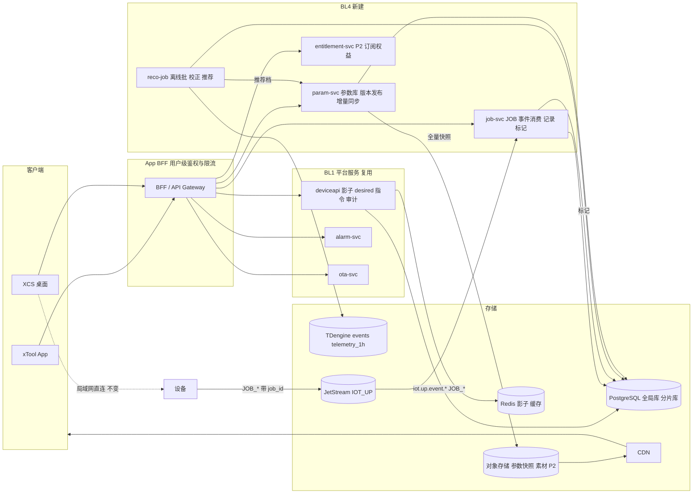

# 软件与内容（BL4）技术方案

> Technical Design · BL4 软件与内容 · App / XCS / 参数库 / 反哺 / 订阅

| 项 | 内容 |
|---|---|
| 文档版本 | v0.1 评审稿 · 2026-09-18 |
| 对应 PRD | docs/prd-bl4-software-content.md |
| 上位方案 | docs/tech-design-aiot-platform.md（18 章平台方案，本文只写 BL4 增量，不重复平台内容） |
| 工程契约 | docs/spec.md；本文新增的服务与接口在评审通过后并入 spec |
| 定位 | BL4 是 BL1 的用户面与 BL3 的数据消费方。P0 只做入口与静态参数库，P1 做动态校正与反哺，P2 做内容与订阅 |

**四条设计原则**

1. **复用不重建**。设备状态、告警、指令、OTA 全部走 BL1 已有的 deviceapi / alarm-svc / ota-svc，BL4 不另起一套设备接口。新建的只有三个服务：param-svc、job-svc、reco-job。
2. **云在旁路，不在加工路径**。XCS 与设备的局域网直连不变，云只读状态、只收元数据。任何云调用都有超时与降级，云端故障时本地加工零影响。
3. **安全与基础控制无条件可用**。订阅校验只允许出现在内容与推荐接口，架构上用独立的 entitlement 服务隔离，代码审查与集成测试双重锁定。
4. **反哺只收参数，不收图纸**。加工记录与标记只含 SN、材料、参数档、结果；文件不上云（P1 云端下发任务除外，且经短时预签名 URL 不持久化）。

## 目录

1. [边界：复用什么，新建什么](#01-边界复用什么新建什么)
2. [目标与 SLO](#02-目标与-slo)
3. [总体架构](#03-总体架构)
4. [账号、授权与限流](#04-账号授权与限流)
5. [App 入口链路](#05-app-入口链路)
6. [XCS 云连接](#06-xcs-云连接)
7. [参数库服务 param-svc](#07-参数库服务-param-svc)
8. [加工记录与反哺链路 job-svc](#08-加工记录与反哺链路-job-svc)
9. [动态校正与推荐 reco-job](#09-动态校正与推荐-reco-job)
10. [云素材与订阅（P2）](#10-云素材与订阅p2)
11. [数据模型](#11-数据模型)
12. [接口清单](#12-接口清单)
13. [非功能、可观测性与容量](#13-非功能可观测性与容量)
14. [隐私与合规](#14-隐私与合规)
15. [事故预推演摘要](#15-事故预推演摘要)
16. [分步实现](#16-分步实现)

---

## 01 边界：复用什么，新建什么

| 能力 | 来源 | BL4 的用法 |
|---|---|---|
| 设备影子、desired、指令、指令结果、遥测查询 | deviceapi（BL1） | App 设备卡片、指令面板、隐私开关、审计页直接调用 |
| 告警列表、ack、close | alarm-svc（BL1） | App 告警中心 |
| 固件、批次、任务进度 | ota-svc（BL1） | App OTA 设置页只读 + 用户策略写 desired |
| 设备绑定 device_binding | 分片库（BL1） | 设备列表、角色（P1） |
| JetStream IOT_UP 事件流 | bridge / pipeline（BL1） | job-svc 作为新增独立消费组消费 JOB_* 事件 |
| TDengine telemetry_1h、consumable_health | BL1 / BL3 | reco-job 动态校正的输入 |
| PII 平台、删除传导 | 集团 | 反哺数据的撤回删除 |
| **param-svc**（新） | 本方案 | 材料字典、参数档、版本发布、增量同步、用户自定义参数 |
| **job-svc**（新） | 本方案 | JOB_* 事件落 job_record、结果标记接口、opt-in 强制 |
| **reco-job**（新，P1 离线批） | 本方案 | 校正系数、推荐档生成、安全关联下线 |
| **entitlement-svc**（新，P2） | 本方案 | 订阅状态与权益，只被内容与推荐接口依赖 |
| App BFF | App 团队 | 聚合上述接口，做用户级鉴权与限流；本文给契约 |

不做的事：不改 EMQX Topic 契约，不新增设备到云的通道，不在 pipeline 里加 BL4 逻辑。

---

## 02 目标与 SLO

| 维度 | 要求 | 测量点 |
|---|---|---|
| 参数库读取 | GET /params P99 < 200 ms；增量同步 P99 < 2 s | param-svc HTTP 直方图 |
| 参数库可用性 | 99.9%；不可用时客户端本地缓存兜底 | 客户端 sync_ok / sync_total |
| 参数发布可见 | 发布后全量客户端 ≤ 10 min 可见；回滚 ≤ 5 min | release 发布时间 → 客户端上报 version 分布 |
| 设备列表一致性 | App 与 XCS 差异 0；新鲜度 ≤ 30 s | 复用影子 SLO |
| 加工记录落库 | JOB_DONE → job_record P99 < 10 s | job-svc consumer lag |
| 订阅校验（P2） | P99 < 100 ms；不可用时按本地缓存放行已解锁内容 | entitlement-svc |
| 安全接口零订阅依赖 | 告警、指令、OTA、影子接口的依赖图中不出现 entitlement | 集成测试 + 依赖扫描 |
| 客户端 | App 冷启动 < 2 s；XCS 加工开始延迟不因云功能增加 | APM |

---

## 03 总体架构



**关键决策**

| 决策 | 备选 | 理由 |
|---|---|---|
| BFF 做用户级鉴权与限流，平台服务只认 user_id | 每个平台服务各自接账号体系 | deviceapi 等 BL1 服务保持无账号依赖；限流维度用 user_id + path，不用 IP（预推演 INC-15、事故复盘） |
| job-svc 作为 JetStream 独立消费组 | 在 pipeline 里加分支 | pipeline 是 BL1 的吞吐关键路径；独立消费组挂了不影响遥测与告警，反之亦然 |
| 参数库全量快照走对象存储 + CDN，增量走 API | 全部走 API | 首次同步与新机型全量拉取量大且内容相同，CDN 命中率高；增量小走 API 简单 |
| 推荐用离线批处理，不做实时 | 实时流计算 | 样本阈值 30 且需人工可审计；每日一批足够，且便于安全关联复核 |
| entitlement 独立服务 | 在 BFF 里查订阅表 | 独立服务让「谁依赖了它」可被依赖图扫描，锁定安全接口零依赖 |

---

## 04 账号、授权与限流

### 4.1 身份

- App 与 XCS 共用集团账号体系，登录后拿到 access token，BFF 校验后解析出 user_id。
- 平台服务（deviceapi 等）只接收 BFF 传入的 `X-User-Id` 与 `X-Source: app|xcs|support|agent`，不直接对公网开放。
- 客服与 Agent 走 xpilot 的服务身份，Source 分别为 support / agent，写入 cmd_audit.source（BL1 FR-19）。

### 4.2 设备授权

每个针对 `{sn}` 的请求，BFF 先查该 user_id 对 sn 的有效绑定：

```sql
SELECT role FROM iot_shard.device_binding WHERE sn=$1 AND user_id=$2 AND unbound_at IS NULL
```

| role | 读状态 / 收告警 | 下指令 | 改隐私开关 / OTA 策略 | 解绑 / 邀请 |
|---|---|---|---|---|
| owner | 是 | 是 | 是 | 是 |
| member（P1） | 是 | 否 | 否 | 否 |

无绑定 → 404（不泄露设备存在性）；有绑定但角色不足 → 403 code 10003。查询结果在 BFF 缓存 60 s，解绑时主动失效。

### 4.3 限流

| 维度 | 参数 | 用途 |
|---|---|---|
| user_id + path | 读 10 rps burst 30；写 2 rps burst 5 | 防 App 版本 bug 的无退避轮询（INC-15） |
| user_id + sn + action | 指令 1 rps burst 1，且同一 cmd 回执未返回前拒绝重复 | 与客户端 CR-06 防抖双保险 |
| 匿名 IP | 登录接口 10 次/分钟 | 尚无身份时的唯一维度，接受 NAT 误伤 |

deviceapi 自带的 IP 限流保留为最后一道。

---

## 05 App 入口链路

### 5.1 六个界面与接口

| 界面 | 读 | 写 | 备注 |
|---|---|---|---|
| 配网与绑定 | GET /devices（绑定列表 + 影子摘要） | POST /devices/{sn}/bind | BLE 配网在端侧，绑定成功以设备首次上线为准 |
| 设备卡片 | GET /devices/{sn}/shadow | — | 见 5.2 刷新策略 |
| 告警中心 | GET /alarms?sn=&status= | POST /alarms/{id}/ack、/close | 状态机在 alarm-svc，客户端只展示 |
| 指令面板 | GET /cmds/{cmd_id} | POST /devices/{sn}/cmd | 白名单 pause / stop / self_check；按钮防抖 |
| 隐私开关 | GET /devices/{sn}/shadow（reported + desired） | PATCH /devices/{sn}/desired | 见 5.3 显示逻辑 |
| OTA 设置 | GET /devices/{sn}/ota（当前任务 + 版本说明） | PATCH desired ota_policy | 自动 / 提醒；推迟 24 h 写 desired |
| 操作审计 | GET /devices/{sn}/audit | — | cmd_audit 按 sn 倒序 |

### 5.2 状态刷新

- P0：客户端前台每 5 s 轮询 shadow，带 `If-None-Match: <version>`；BFF 比较 Redis 影子的更新时间戳，未变返回 304。后台停止轮询。
- P1：BFF 提供 SSE `GET /devices/{sn}/events`，订阅 Redis keyspace 或 pipeline 发布的影子变更通知，推送给客户端。P0 不做，避免为入口引入长连接运维。

### 5.3 隐私开关的显示逻辑（CR-04）

```
reported.x == desired.x            → 显示 desired.x（已生效）
reported.x != desired.x 且设备在线 → 显示「同步中」，10 s 未收敛提示重试
reported.x != desired.x 且设备离线 → 显示 reported.x + 「上线后生效」
```

以 reported 为准是隐私合规要求：用户关了摄像头云存储，界面不能在设备真正关闭前显示「已关」。

### 5.4 指令幂等

客户端每次点击生成 `Idempotency-Key`（UUID），BFF 以 `idem:{user_id}:{key}` 在 Redis 记录 60 s；重复请求返回首次的 cmd_id。deviceapi 的审计先于指令语义不变。

---

## 06 XCS 云连接

### 6.1 原则

局域网直连协议、设备发现、文件传输、加工控制全部不变。云只增加两件事：读设备列表与状态；把 job 元数据交给设备随事件上报。

### 6.2 设备列表与状态

XCS 登录后调用与 App 相同的 `GET /devices`，列表按 device_binding 返回，状态摘要来自影子。XCS 把云端列表与局域网发现结果按 SN 合并显示：同一台机器既在局域网又在云端时，加工走局域网，状态以局域网实时为准、云端为补充。

超时与降级（CR-02）：读 3 s、写 5 s；连续 3 次超时进入 5 分钟静默期不再请求；静默期界面显示「云端不可用」，本地功能不受影响。

### 6.3 任务元数据（FR-413）

```
XCS 生成 job_id = UUIDv4
XCS ──局域网加工指令 + {job_id, material_id, param_profile_id, params_hash}──▶ 设备
设备 ──JOB_START {seq, ts, code:"JOB_START", job_id, material_id, param_profile_id, params_hash}──▶ 云
设备 ──JOB_DONE  {..., job_id, duration_s}──▶ 云
```

- 设备原样透传四个字段，不理解其含义；固件改动只是把局域网指令里的元数据带进事件。
- `params_hash = sha256(规范化参数 JSON)`，用于识别用户是否修改了参数档；参数本身不上传，客户端本地按 hash 可对应。
- 设备 `job_feedback_optin`（reported）为 false 时，**设备端不填充**这四个字段（云端 job-svc 再校验一次，双保险）。

### 6.4 云端下发加工任务（FR-414，P1）

```
XCS ──POST /devices/{sn}/jobs {file_sha256, size, material_id, param_profile_id}──▶ BFF
BFF 校验：绑定 owner；影子 work_state == 0 空闲；设备在线
BFF ──预签名 PUT URL（24 h）──▶ XCS 上传文件到对象存储
BFF ──deviceapi POST /cmd action=job_start params={url(预签名 GET 1 h), sha256, job_id, ...}──▶ 设备
设备 下载 → 校验 sha256 → 开始加工 → JOB_START
对象存储生命周期：24 h 自动删除
```

白名单扩展：`job_start` 加入 deviceapi 白名单需满足两个额外条件：deviceapi 在下发前读影子确认 work_state == 0；params 必须含 sha256。这是 BL1 白名单原则「只读或可逆」之外的第一个例外，需安全评审签字后才实现。

---

## 07 参数库服务 param-svc

### 7.1 数据模型

```
material        材料字典（全局库）：material_id, name, category, thickness_mm, vendor
param_profile   参数档（全局库）：id, product_key, module_model, material_id, params JSONB,
                source official|recommended|user, version_added, version_removed, sample_count, confidence, approved_by
param_release   发布记录（全局库）：version PK（按 product_key 单调递增）, product_key, note, snapshot_url, created_by, approved_by, released_at, rolled_back_from
user_param      用户自定义（分片库）：id, user_id, product_key, module_model, material_id, params JSONB, updated_at
```

### 7.2 版本化与发布

- 每个 product_key 的参数库是一条单调递增的 version 序列。一条 param_profile 用 `version_added` 与 `version_removed` 描述生命周期，任意 version 下的有效集合 = `version_added <= v AND (version_removed IS NULL OR version_removed > v)`。
- **发布**：运营在管理台提交变更集 → 生成新 version → 写 param_release，`approved_by` 非空是数据库约束（与 ota_batch 同一思路）：

```sql
CONSTRAINT ck_release_approved CHECK (approved_by IS NOT NULL AND approved_by <> created_by)
```

- **回滚**：不是删除版本，而是发布一个新 version，其有效集合等于目标旧版本；`rolled_back_from` 记录来源。客户端只认 version 单调，回滚对客户端就是一次普通更新。
- 发布同时生成全量快照 JSON 上传对象存储，`snapshot_url` 经 CDN 分发。

### 7.3 同步协议

```
GET /api/v1/params/releases/latest?product_key=          → {version, snapshot_url, released_at}
GET /api/v1/params?product_key=&since_version=           → {version, added:[...], removed:[ids]}
```

- 客户端本地无缓存或落后 > 20 个版本 → 拉 snapshot_url 全量。
- 否则拉增量，按 removed 删、added 加，写入本地缓存并记录 version。
- 增量接口幂等，可重复拉取。响应带 `ETag: version`。

### 7.4 客户端缓存（CR-03）

- 内置出厂版本随安装包；本地缓存文件带 version 与 sha256；损坏时回退内置版本并触发全量同步。
- 用户自定义参数单独存储，不随官方库更新被覆盖；开启同步时经 `PUT /api/v1/user-params` 上传，多端按 updated_at 最后写入胜出。

### 7.5 module_model 的来源

参数档按 module_model 索引。P0 由固件在上线时上报 `module_model` 属性（物模型 v1.1）；固件不能可靠上报时，App 提供手动选择并写 desired，客户端以 reported 为准。这是 PRD 开放问题 3，方案两条路都留了。

---

## 08 加工记录与反哺链路 job-svc

### 8.1 消费

```
JetStream IOT_UP, durable consumer "job", FilterSubject iot.up.event.*
  → 只处理 code ∈ {JOB_START, JOB_DONE, JOB_FAIL, JOB_PAUSE}
  → 校验 reported.job_feedback_optin（Redis 影子）；false 则丢弃 job 字段，只计数不落库
  → JOB_START：INSERT job_record(job_id, sn, material_id, param_profile_id, params_hash, started_at)
    ON CONFLICT (job_id) DO NOTHING
  → JOB_DONE / JOB_FAIL：UPDATE job_record SET finished_at, outcome WHERE job_id
  → Ack；PG 失败 Nak
```

与 pipeline、alarm 同为 IOT_UP 的独立消费组，互不阻塞。事件本身仍由 pipeline 写 TDengine events 明细，job-svc 只维护结构化的 job_record。

### 8.2 结果标记

```
POST /api/v1/jobs/{job_id}/feedback {rating: good|burnt|uncut}
  BFF：绑定校验（job_record.sn 属于该 user）
  job-svc：再次校验 opt-in；INSERT job_feedback ON CONFLICT (job_id) DO UPDATE
```

客户端在 JOB_DONE 后 10 分钟内提示一次（CR-08）；job-svc 不推送，由客户端从影子或本地事件感知完成。

### 8.3 opt-in 与撤回

- 写入前双校验：设备端不填字段 + job-svc 校验影子。两处都以 reported 为准。
- 撤回：desired job_feedback_optin=false → 设备回报 → job-svc 收到影子变更（或每日扫描）→ 该 SN 的 job_record 与 job_feedback 全部删除，写删除日志。与 BL1 §10.2 删除传导同一流程。
- job_record 只含 SN。从 SN 到用户的映射只在 device_binding，且删号后 unbound。

---

## 09 动态校正与推荐 reco-job

### 9.1 校正系数（FR-424）

对每台设备的每个官方参数档，输出功率与速度的校正系数：

```
inputs:  laser_hours（telemetry_1h 最新累计）、consumable_health.health（BL3，0 到 100）
k_power = clamp(1 + a × (1 - health/100) + b × laser_hours/rated_hours, 0.8, 1.25)
k_speed = clamp(1 - c × (1 - health/100), 0.8, 1.25)
```

- a、b、c 按机型与模块由固件团队给出并版本化存 param_release 的附属配置；P1 初始值保守（a=0.15, b=0.05, c=0.05）。
- **硬上下限 [0.8, 1.25]** 是代码常量，不可配置。超过说明模块该换了，界面提示更换而不是继续加功率。
- 校正原因必须可显示：返回 `{k_power, k_speed, reasons:[{type:"laser_hours", value:320, effect:"+6%"}]}`。
- 校正是**客户端应用**的：param-svc 只返回系数与原因，XCS 在官方档上乘系数并明确显示「已校正」，用户可一键回官方档。

### 9.2 推荐档生成（FR-426）

每日批：

```
按 (product_key, module_model, material_id, params_hash) 聚合 job_feedback
  样本 = distinct sn 数；样本 < 30 不生成
  good_ratio = good / 样本；burnt_ratio、uncut_ratio 同理
  候选 = good_ratio ≥ 0.8 且 样本 ≥ 30 的 params_hash
  → 用该 hash 对应的参数（从任一上传了自定义参数且同步的用户处取；无则不生成）
  → 写 param_profile(source=recommended, sample_count, confidence=good_ratio)，version_added = 下一个 release
  → 推荐档随下一次发布进入参数库，与 official 并列，不替换 official 的默认选中
```

反刷偏：按 SN 去重；单 SN 单日同 (material, hash) 只计一次；标记率异常（某 hash 的 good 全部来自 ≤ 3 台设备）不进候选。

### 9.3 安全关联下线

每日批同时执行：任一 recommended 档在过去 7 天内，使用该档的任务中出现 FLAME_DETECTED / OVER_TEMP 的比例 > 同材料 official 档的 2 倍且绝对数 ≥ 3 → 自动标记 `version_removed = 下一个 release` 并告警到产品与固件团队。这是 PRD 风险表第一条的落地。

---

## 10 云素材与订阅（P2）

### 10.1 entitlement-svc

```
subscription  user_id, plan(monthly|yearly), status(active|grace|expired), started_at, expires_at, provider_ref
entitlement   user_id, feature(assets|advanced_reco|fleet_view), granted_until
GET /api/v1/entitlements/me → {features:[...], expires_at}   缓存 5 min，客户端本地缓存 24 h
```

支付回调只更新 subscription，entitlement 由 subscription 派生。

### 10.2 安全零依赖的锁定

- **依赖图**：deviceapi、alarm-svc、ota-svc、job-svc、param-svc 的 go.mod / import 图中不得出现 entitlement 客户端包；CI 用 `go list -deps` 扫描断言。
- **BFF 路由表**：只有 `/assets/*`、`/params/recommended/*`、`/fleet/*` 三组路由挂 entitlement 中间件；路由表在代码中集中声明，评审项。
- **集成测试**：entitlement-svc 停机时，冒烟五步（影子、desired、指令、结果、告警）必须全过。

### 10.3 素材

asset 元数据在全局库，文件在对象存储经 CDN；导入即下载到 XCS 本地，退订不删已导入文件（FR-442）。版权与审核走内容平台，不在本方案范围。

---

## 11 数据模型

### 11.1 全局库 iot_global 新增

| 表 | 关键列 | 约束 |
|---|---|---|
| material | material_id PK, name, category, thickness_mm, vendor, created_at | |
| param_profile | id, product_key, module_model, material_id, params JSONB, source, version_added, version_removed, sample_count, confidence, approved_by | 索引 (product_key, version_added), (product_key, version_removed) |
| param_release | version BIGINT, product_key, note, snapshot_url, created_by, approved_by, released_at, rolled_back_from | PK (product_key, version)；**ck_release_approved** |
| param_correction_cfg | product_key, module_model, a, b, c, rated_hours, version | 校正系数配置，随 release 版本化 |
| asset（P2） | id, title, tags, product_keys, url, license, status | |
| subscription / entitlement（P2） | 见 §10.1 | |

### 11.2 分片库 iot_shard 新增

| 表 | 关键列 | 约束 |
|---|---|---|
| job_record | job_id PK, sn, material_id, param_profile_id, params_hash, started_at, finished_at, outcome, duration_s | 索引 (sn, started_at DESC)；保留 2 年 |
| job_feedback | job_id PK REFERENCES job_record, sn, rating, created_at | |
| user_param | id, user_id, product_key, module_model, material_id, params JSONB, updated_at | 索引 user_id |
| device_binding.role | 已有列，P1 启用 member | |

### 11.3 物模型 v1.1 与 TDengine

- events 超级表新增列：`job_id BINARY(36)`, `material_id BINARY(32)`, `param_profile_id BINARY(32)`, `params_hash BINARY(64)`；`ALTER STABLE iot.events ADD COLUMN ...`，pipeline 的事件解析对未知字段透传，因此老固件不受影响。
- 属性新增 `module_model`（string，上线时上报）、`job_feedback_optin`（bool，desired 下发）。
- 影子 reported 增加对应字段，无需改 pipeline 代码（影子按上报字段写）。

### 11.4 Redis 新增

| Key | 用途 | TTL |
|---|---|---|
| idem:{user_id}:{key} | 指令幂等 | 60 s |
| binding:{user_id}:{sn} | 绑定与角色缓存 | 60 s，解绑主动删 |
| params:latest:{product_key} | 最新 release 版本号 | 无，发布时更新 |
| ent:{user_id}（P2） | 权益缓存 | 5 min |

---

## 12 接口清单

BFF 对客户端暴露；平台服务接口见 spec.md §6。

| 方法 路径 | 用途 | 后端 | 阶段 |
|---|---|---|---|
| GET /api/v1/devices | 绑定设备列表 + 影子摘要 | device_binding + deviceapi | P0 |
| POST /api/v1/devices/{sn}/bind | 绑定 | 分片库 | P0 |
| GET /api/v1/devices/{sn}/shadow | 影子（支持 If-None-Match） | deviceapi | P0 |
| PATCH /api/v1/devices/{sn}/desired | 隐私开关、OTA 策略 | deviceapi | P0 |
| POST /api/v1/devices/{sn}/cmd | 指令（Idempotency-Key） | deviceapi | P0 |
| GET /api/v1/cmds/{cmd_id} | 指令结果 | deviceapi | P0 |
| GET /api/v1/alarms · POST /alarms/{id}/ack · /close | 告警 | alarm-svc | P0 |
| GET /api/v1/devices/{sn}/ota | OTA 任务与版本说明 | ota-svc | P0 |
| GET /api/v1/devices/{sn}/audit | 操作审计 | cmd_audit | P0 |
| GET /api/v1/params/releases/latest | 最新版本与快照 | param-svc | P0 |
| GET /api/v1/params?since_version= | 增量同步 | param-svc | P0 |
| PUT /api/v1/user-params | 自定义参数同步 | param-svc | P0 |
| POST /internal/params/releases | 发布（双人审批） | param-svc 管理台 | P0 |
| POST /api/v1/jobs/{job_id}/feedback | 结果标记 | job-svc | P1 |
| GET /api/v1/devices/{sn}/correction?param_profile_id= | 校正系数与原因 | param-svc ← reco-job | P1 |
| POST /api/v1/devices/{sn}/jobs | 云端下发任务 | BFF + deviceapi | P1（需评审） |
| GET /api/v1/devices/{sn}/events（SSE） | 影子推送 | BFF | P1 |
| GET /api/v1/entitlements/me · GET /assets | 订阅与素材 | entitlement-svc | P2 |

---

## 13 非功能、可观测性与容量

### 13.1 容量

| 项 | 估算 |
|---|---|
| 参数库 | 单机型全量快照 < 2 MB；增量每版 < 50 KB；千万设备首日全量走 CDN，源站压力可忽略 |
| JOB 事件 | 300 万在线 × 日均 3 任务 × 4 事件 ≈ 3600 万/日，约 420/s，job-svc 单消费组足够；job_record 每日 900 万行，2 年约 66 亿行，按月分区 |
| 反哺标记 | 假设 opt-in 30%、标记率 20%，每日约 54 万条 |
| 推荐批 | 每日一次，聚合 30 天窗口，StarRocks 或 PG 物化视图，分钟级 |
| BFF | 300 万在线用户前台轮询 5 s 一次，峰值约 60 万 rps 中 304 占 95%；P1 上 SSE 后降一个数量级 |

BFF 轮询是 P0 最大的流量项，304 路径必须只查 Redis 不查 PG。

### 13.2 看板

| 看板 | 指标 |
|---|---|
| 入口 | BFF 各路由 QPS / 延迟 / 4xx 5xx、304 比例、限流 429 数、绑定成功率 |
| 参数库 | 客户端 version 分布、sync_ok 率、发布到 P95 客户端可见时长、回滚次数 |
| 反哺 | job consumer lag、opt-in 率、job_record 日增、标记率、被 opt-in 拦截的事件数 |
| 推荐 | 候选数、生成数、安全关联下线数、采纳率、首刀成功率 |
| 订阅（P2） | 校验延迟、缓存命中、entitlement 不可用期间安全接口成功率（必须 100%） |

---

## 14 隐私与合规

| 数据 | 内容 | 存放 | 同意 |
|---|---|---|---|
| job_record / job_feedback | SN、材料、参数档 id、参数 hash、结果、标记 | 分片库 | job_feedback_optin，撤回即删 |
| user_param | user_id、参数 | 分片库 | 同步开关 |
| 加工文件 | 图纸 | **不上云**；P1 云端下发经预签名 URL 24 h 生命周期 | 每次下发即同意 |
| 推荐模型输入 | 聚合统计，不含 SN | 全局库 | 无个人数据 |
| 订阅 | user_id、plan、支付引用 | 全局库 | 购买协议 |

- 反哺文案必须写明：只上传参数与结果，不上传设计文件；推荐档为社区统计结果，官方不对材料损耗负责。
- 参数 hash 的规范化规则公开，用户可自行验证上传内容。
- 删号传导：device_binding unbound → job_record 按 SN 不再可关联；user_param 删除；订阅按支付平台规则处理。

---

## 15 事故预推演摘要

BL1 的 27 条预推演（docs/incident-premortem-bl1.md）全部适用于 BL4 的入口部分。BL4 特有的新增六条，处置方案在 P1 立项时补全：

| ID | 事故 | 级别 | 第一检测信号 | 止血 |
|---|---|---|---|---|
| INC-4-01 | 参数库发布错误（如功率单位错），全量客户端 10 分钟内拿到 | S1 | 发布后 JOB_FAIL 与 burnt 标记突增；客服工单 | 发布回滚 version（≤ 5 min）；推送客户端强制同步 |
| INC-4-02 | 推荐档导致烧材或安全事件 | S1 | §9.3 安全关联；FLAME 事件关联 param_profile_id | 立即 version_removed 该档；通知使用过的用户 |
| INC-4-03 | 校正系数计算错误把功率推到上限 | S2 | k_power 分布集中在 1.25 | 关闭校正（返回 k=1），客户端回官方档 |
| INC-4-04 | XCS 云调用阻塞本地加工 | S2 | XCS APM 加工开始延迟 P95 上升；云调用超时率 | 客户端静默期强制生效；紧急版本关闭云功能开关 |
| INC-4-05 | entitlement 故障误伤安全接口 | S1 | 依赖扫描本应阻止；冒烟五步失败 | 回滚引入依赖的版本 |
| INC-4-06 | BFF 轮询风暴（App 版本 bug 去掉退避） | S2 | 429 比例、PG 连接数 | user_id 限流生效；紧急下线该版本；304 路径确认只走 Redis |

---

## 16 分步实现

### 16.1 P0（随 BL1 迭代 1 到 4）

| 迭代 | BL4 交付 | 验收 |
|---|---|---|
| 1 | BFF 骨架：账号接入、绑定校验、user_id 限流；GET /devices、shadow 透传（含 304） | App 看到 50 台模拟设备 |
| 2 | 告警中心与指令面板接 alarm-svc / deviceapi；Idempotency-Key；审计页 | 火焰告警在 App 确认；指令防抖 |
| 3 | param-svc：material / param_profile / param_release、发布与双人审批、增量同步、快照 CDN；客户端缓存 | 发布 → 客户端可见 ≤ 10 min；回滚演练 |
| 4 | 隐私开关 reported 显示逻辑；OTA 设置页；XCS 设备列表只读 + 降级；物模型 v1.1 JOB 字段进固件 | 断网 XCS 零影响；JOB_* 未 opt-in 字段为空审计 |

仓库落点：`cmd/param-svc`、`internal/param`；BFF 由 App 团队仓库承载，契约在本文 §12。

### 16.2 P1（BL3 健康度可用后两个迭代）

- job-svc 消费组与 job_record / job_feedback；结果标记接口。
- reco-job 每日批：校正系数、推荐档、安全关联下线。
- member 角色；SSE 影子推送。
- XCS 云端下发任务（待安全评审）。

仓库落点：`cmd/job-svc`、`internal/job`；`cmd/reco-job`、`internal/reco`。

### 16.3 P2

- entitlement-svc、subscription、asset；依赖扫描进 CI；冒烟增加「entitlement 停机」用例。

### 16.4 P0 验收清单（可签字）

1. App 六界面走通 BL1 冒烟五步。
2. XCS 断网测试：本地加工零影响，云端列表显示「不可用」。
3. 参数库：发布、增量、全量、回滚四项演练通过；客户端缓存损坏回退内置版本。
4. 隐私开关显示以 reported 为准的三态测试通过。
5. JOB_* 事件在未 opt-in 设备上四个字段为空，数据字典审计通过。
6. BFF 限流 user_id + path 生效；IP 限流仅登录接口。

---

## 附录 A · PRD 需求对照

| PRD 需求 | 本方案章节 |
|---|---|
| FR-401 到 FR-407 App 六界面与审计 | §5、§4 |
| FR-408 多用户 | §4.2 |
| FR-411 到 FR-413 XCS 云连接与任务元数据 | §6.1 到 §6.3 |
| FR-414 云端下发任务 | §6.4 |
| FR-415 健康度显示 | §9.1 |
| FR-421 到 FR-423 参数库 v1、同步、自定义 | §7 |
| FR-424 动态校正 | §9.1 |
| FR-425 / FR-426 反哺与推荐 | §8、§9.2、§9.3 |
| FR-427 社区参数 | P2，未展开 |
| FR-431 到 FR-433 远程监控承载 | §5.1（复用 BL1） |
| FR-441 到 FR-444 素材与订阅 | §10 |
| CR-01 到 CR-09 客户端 | §5.2 到 §5.4、§6.2、§7.4 |
| §6 数据需求 | §11 |
| §7 非功能 | §2、§13 |
| §10 风险 | §15 |

---

*BL4 技术方案 v0.1 · 与平台方案（18 章）互为上下位：平台方案定义设备到云的链路，本文定义用户到云的入口与参数、反哺、订阅三条业务链路。三个新服务 param-svc / job-svc / reco-job 遵守 docs/spec.md §8 工程纪律；entitlement 与安全接口零依赖是本文唯一不可协商的架构约束。*
