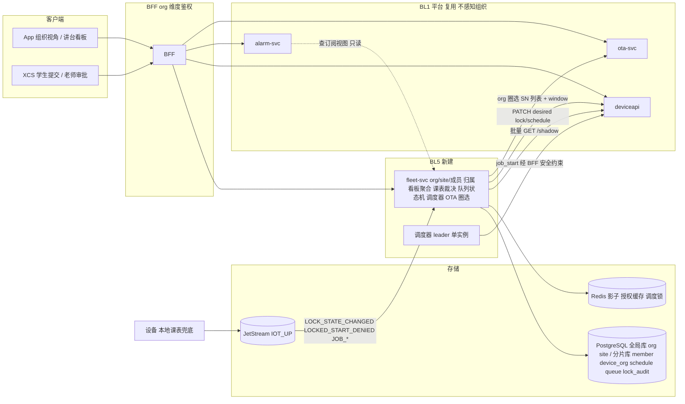

# 教育与 B 端（BL5）技术方案

> Technical Design · BL5 教育与 B 端 · 组织租户 / 多机看板 / 时段策略 / 任务队列 / 批量 OTA

| 项 | 内容 |
|---|---|
| 文档版本 | v0.1 评审稿 · 2026-09-18 |
| 对应 PRD | docs/prd-bl5-education-b2b.md |
| 上位方案 | docs/tech-design-aiot-platform.md（平台 18 章）、docs/tech-design-bl4-software-content.md（BFF 鉴权、云端下发任务、entitlement 零依赖） |
| 工程契约 | docs/spec.md；本文新增的 fleet-svc、desired 字段与 DDL 在评审通过后并入 spec |
| 定位 | BL5 是 BL1 平台与 BL4 入口之上的「组织层」：把设备、用户、策略、任务从个人维度提升到组织维度。只新建一个服务 fleet-svc 与一份 DDL，其余全部复用 |

**四条设计原则**

1. **组织层在旁路，安全层不知道组织存在**。deviceapi、alarm-svc、ota-svc、固件安全规则都不依赖 fleet-svc。fleet-svc 挂了，机器照常停机、告警照常推送、单台 OTA 照常做，只是看板、课表编辑与队列停摆。
2. **禁用只作用于一个动作：开始新任务**。locked 不影响进行中任务、急停、安全事件、告警、OTA。这是固件红线 DR-501，也是云端所有 lock 逻辑的边界。
3. **策略下发用 desired，兜底靠本地**。课表以 desired.schedule 快照下发，设备本地按时钟切换；云端 lock 只是覆盖，不是唯一来源。断网时行为与在线一致。
4. **租户隔离是查询层的强约束，不是应用层的习惯**。所有 BL5 表带 org_id，所有查询以 org_id 为首列条件，BFF 路由组级中间件注入 org_id，越权测试进 CI 阻断。

## 目录

1. [边界：复用什么，新建什么](#01-边界复用什么新建什么)
2. [目标与 SLO](#02-目标与-slo)
3. [总体架构](#03-总体架构)
4. [组织、租户与授权](#04-组织租户与授权)
5. [多机看板与批量影子](#05-多机看板与批量影子)
6. [时段策略与锁定](#06-时段策略与锁定)
7. [班级任务队列与调度器](#07-班级任务队列与调度器)
8. [批量 OTA 与维护窗口](#08-批量-ota-与维护窗口)
9. [告警订阅与耗材汇总](#09-告警订阅与耗材汇总)
10. [B 端订阅（P2）](#10-b-端订阅p2)
11. [数据模型](#11-数据模型)
12. [接口清单](#12-接口清单)
13. [非功能、可观测性与容量](#13-非功能可观测性与容量)
14. [隐私与合规](#14-隐私与合规)
15. [事故预推演摘要](#15-事故预推演摘要)
16. [分步实现](#16-分步实现)
17. [本仓库实现清单](#17-本仓库实现清单)

---

## 01 边界：复用什么，新建什么

| 能力 | 来源 | BL5 的用法 |
|---|---|---|
| 影子读、desired 写、指令、审计 | deviceapi（BL1） | 批量影子聚合、lock / schedule 下发、job_start 下发 |
| 告警状态机与推送 | alarm-svc（BL1） | 不改；订阅关系（谁收哪个站点的告警）在 fleet-svc，推送目标由 alarm-svc 查 fleet-svc 提供的只读视图 |
| OTA 批次、灰度、熔断、idle_only | ota-svc（BL1） | 组织批次是平台批次的子集；新增 policy.window 与 org 圈选适配 |
| BFF 鉴权、user_id 限流、幂等键、SSE | BL4 | 扩展 org 维度；讲台只读 token |
| 云端下发任务 job_start | BL4 §6.4 | 队列调度器的唯一下发路径，沿用空闲校验、sha256、预签名 URL 1 h |
| 参数库、健康度 | BL4 param-svc、BL3 consumable_health | 审批时显示参数与材料；集采汇总 |
| entitlement | BL4 P2 | 组织维度订阅 |
| **fleet-svc**（新，:8094） | 本方案 | org / site / 成员、设备归属、批量影子聚合、课表与锁裁决、队列状态机与调度器、批量 OTA 圈选适配、告警订阅视图、集采汇总 |
| **sql/bl5.sql**（新） | 本方案 | 9 张表，见 §11 |
| **固件 DR-501 到 DR-505** | 固件团队 | locked 语义、本地课表、解锁码 |

不做的事：不改 EMQX Topic；不在 pipeline、alarm-svc 里加组织逻辑；不做支付。

---

## 02 目标与 SLO

| 维度 | 要求 | 测量点 |
|---|---|---|
| 看板加载 | 200 台站点 P99 < 2 s；组织聚合计数 P99 < 500 ms | fleet-svc HTTP 直方图 |
| 策略生效 | 课表变更 → 在线设备 lock_state 变化 ≤ 60 s | schedule_policy.updated_at → 影子 reported.lock_state 变化 |
| 本地兜底 | 断网窗口切换准时 ±60 s | 台架 |
| 教师解锁 | 解锁 → 设备 reported.lock_state=2 P99 < 5 s | lock_audit.created_at → 影子 |
| 队列调度 | 设备空闲 → job_start 下发 ≤ 30 s；调度器故障恢复 ≤ 5 min 且零重复下发 | queue_item 状态时间戳；对账 |
| 批量 OTA | 窗口外下发数 = 0；站点并发下载 ≤ 5 | ota_device_task 时间 vs 窗口 |
| 租户隔离 | 跨 org 访问 = 0 | 越权测试 + 访问日志对账 |
| 安全零依赖 | fleet-svc 停机时冒烟五步与 locked 台架全部通过 | 集成测试 |
| 规模 | 1 万组织、单组织 2000 台、单站点 200 台 | 容量测试 |

---

## 03 总体架构



**关键决策**

| 决策 | 备选 | 理由 |
|---|---|---|
| fleet-svc 单服务承载全部组织逻辑 | 拆 org-svc / queue-svc / policy-svc | P0 规模不需要拆；组织、策略、队列共享同一份授权与归属模型，拆开只增加一致性问题 |
| lock 用 desired 下发而不是指令 | 指令 lock / unlock | desired 有版本、可收敛、离线可补；指令是一次性动作。锁是状态不是动作 |
| 课表快照整份下发到设备 | 云端每个窗口边界发一次 lock | 断网兜底需要设备自己知道课表；云端 lock 只做覆盖 |
| 调度器 leader 单实例 + PG 条件 UPDATE | 每副本各自调度 | 避免重复下发；PG advisory lock 选 leader，状态迁移用条件 UPDATE 兜底双保险 |
| alarm-svc 不改，只查 fleet-svc 只读视图决定推送目标 | alarm-svc 引入 org 表 | 安全链路不引入组织依赖；视图不可用时回退到设备个人绑定用户 |
| 组织 OTA 批次是平台批次子集 | 组织自建独立批次 | 保证组织不能绕过灰度与熔断；组织只决定「哪些设备、什么时候」 |

---

## 04 组织、租户与授权

### 4.1 模型

```
org（学校 / 工作室，可有 parent_id）
 └─ site（教室 / 车间，带时区 tz）
     └─ device_org（sn → org_id, site_id；一台设备同时只属一个组织）
org_member（org_id, user_id, role ∈ org_admin | teacher | student）
```

### 4.2 角色矩阵

| 动作 | org_admin | teacher | student | 个人绑定 owner（设备已归属组织时） |
|---|---|---|---|---|
| 看板 / 设备状态 | 是 | 本站点 | 本队列绑定设备只读 | 是 |
| 收告警推送 | 是 | 订阅站点 | 否 | 是（保留） |
| 编辑课表 | 是 | 本站点 | 否 | 否 |
| 临时解锁 | 是 | 本站点 | 否 | 否 |
| 下 pause / stop | 是 | 本站点 | 否 | **否**（置灰） |
| 队列审批 | 是 | 本队列 | 否 | 否 |
| 提交任务 | 是 | 是 | 本队列 | 否 |
| 批量 OTA | 是 | 否 | 否 | 否 |
| 成员与归属管理 | 是 | 否 | 否 | 否 |
| 改隐私开关 | 是 | 否 | 否 | 否 |

个人绑定用户保留「看」与「收告警」，失去「控」。冲突以组织为准并写 lock_audit / cmd_audit 留痕，通知个人用户。

### 4.3 BFF 授权合并

```
请求 /orgs/{org_id}/... :
  1 token → user_id
  2 org_member(org_id, user_id, removed_at IS NULL) → role；无 → 404
  3 若路径含 site_id：site.org_id == org_id 否则 404
  4 若路径含 sn：device_org.sn.org_id == org_id 否则 404
  5 角色矩阵判定 → 403 code 10003
请求 /devices/{sn}/cmd（个人视角）:
  BL4 绑定校验后追加：device_org 存在且 action ∈ 控制类 → 403「由组织管理」
```

授权结果缓存 `orgauth:{user_id}:{org_id}` 60 s，成员移除、角色变更、归属变更事务内主动删缓存（多副本用 Redis，不用进程内，INC-4-04 教训）。

### 4.4 租户隔离的三道锁

1. 所有 BL5 表 org_id 非空且为复合索引首列；查询模板由 fleet-svc 的 repo 层统一拼接，不允许 handler 直接写 SQL。
2. BFF `/orgs/{org_id}` 路由组级中间件注入 `ctx.org_id`，repo 层从 ctx 取，不从请求体取。
3. CI 越权测试：A 组织成员用 B 组织的 org_id / site_id / sn 遍历全部路由，必须 100% 404。

---

## 05 多机看板与批量影子

### 5.1 批量影子

deviceapi 新增 `POST /api/v1/devices/shadows {sns:[...]}`（≤ 200），一次 Redis MGET 返回各 SN 的 reported 摘要（work_state、progress、lock_state、fw_version、updated_at、open_alarms 由 alarm-svc 计数缓存）。fleet-svc 按站点取 device_org 的 SN 列表调用它。

### 5.2 聚合与缓存

```
站点看板 GET /orgs/{org}/sites/{site}/dashboard
  → SN 列表（PG，缓存 60 s）→ 批量影子 → 逐台状态 + 站点计数
  → ETag = max(updated_at) 与 SN 列表 hash 组合；If-None-Match 命中 304
组织看板 GET /orgs/{org}/dashboard
  → 各站点计数（Redis 缓存 15 s，站点看板刷新时顺带更新）
```

在线判定复用 deviceapi 的 90 s 规则；待升级标记 = fw_version 不等于该 product_key 已到达 100% 档的最新固件。

### 5.3 刷新

P0 讲台看板 30 s 轮询带 ETag，后台停止；P1 复用 BL4 SSE，断线回退轮询。

---

## 06 时段策略与锁定

### 6.1 课表模型

```json
{
  "version": 12,
  "tz": "America/Los_Angeles",
  "weekly": { "mon": [["08:00","12:00"],["13:30","17:00"]], "tue": [...], ... },
  "overrides": [ { "date": "2026-11-27", "windows": [] } ]
}
```

窗口内 = 允许使用；窗口外 = locked。空 weekly 表示始终允许（未启用课表的站点）。

### 6.2 下发与收敛

```
课表保存 → schedule_policy.version++（同一事务）
  → 对站点全部 SN：PATCH desired {schedule: <快照>, lock: <当前时刻应有值>}
  → 设备回报 reported.schedule_version 与 lock_state
  → fleet-svc 每分钟对账：desired.schedule.version != reported.schedule_version 超过 10 分钟的在线设备 → 重发并计数
```

云端不逐个窗口边界发 lock；设备按本地课表切换。云端每分钟计算「此刻应有 lock」并只对 **reported 与应有值不一致且在线** 的设备补发 desired.lock，作为时钟漂移的纠偏。

### 6.3 临时解锁

```
POST /orgs/{org}/sites/{site}/devices/{sn}/unlock {minutes: 60}   （teacher+）
  → 校验 minutes ≤ org 上限（默认 240）
  → PATCH desired {lock:false, lock_expires_at: now+minutes}
  → INSERT lock_audit(action=temp_unlock, actor, reason)
设备：lock_state=2，到期自动按本地课表回到应有状态并上报 LOCK_STATE_CHANGED
云端：到期后对账若 reported 仍为 2 → 补发 lock=true
```

站点级解锁是对站点全部 SN 循环执行，单条失败不影响其它。

### 6.4 裁决

个人绑定用户 PATCH desired 含 lock / schedule 字段且设备已归属组织 → BFF 403 并写 lock_audit(action=denied_personal)。组织策略与个人 desired 其它字段（如功率上限）不冲突，各自生效。

### 6.5 边界（与 DR-501 一致）

lock 只影响「开始新任务」：设备本地开始键、云端 job_start 均拒绝并上报 LOCKED_START_DENIED。pause / stop / self_check、OTA、安全事件、急停、告警不受 lock 影响。云端侧对应：队列调度器在下发前检查 reported.lock_state == 0；deviceapi 的 pause / stop 白名单判定不读 lock。

---

## 07 班级任务队列与调度器

### 7.1 状态机

```
submitted ─审批通过─▶ approved ─调度分配─▶ assigned ─job_start 成功─▶ dispatched ─JOB_START─▶ running ─JOB_DONE/FAIL─▶ done | failed
    │                    │                    │
    └─退回─▶ rejected    └─学生取消─▶ canceled  └─10 min 未开始─▶ skipped（skip_count+1，回队尾 approved；≥2 → needs_teacher）
```

全部迁移用带前置状态的条件 UPDATE，affected = 0 即冲突（与 alarm 状态机同一手法）。

### 7.2 审批

- `auto_approve_materials` 白名单命中且参数档为 official → 自动 approved，记 approved_by = "auto"。
- 否则 teacher 审批：看材料、参数、预览缩略图（客户端生成，≤ 100 KB，随 item 上传到预签名 URL，24 h 生命周期）。

### 7.3 调度器

```
leader 选举：PG advisory lock pg_try_advisory_lock(hash('fleet-scheduler'))，持锁副本每 10 s 跑一轮，失锁即停
每轮：
  对每个 queue：
    候选设备 = queue.device_sns ∩ reported{work_state==0, lock_state==0, online}
             − 已有 assigned/dispatched/running item 的设备
    对每台候选设备：
      item = 按公平轮转选 approved 项（同一 submitter 连续项之间优先其它 submitter）
      UPDATE queue_item SET status='assigned', assigned_sn=$sn WHERE item_id=$id AND status='approved'   -- affected=0 → 别人抢了，跳过
      调 BFF POST /devices/{sn}/jobs（BL4 §6.4 全部约束）→ 成功 → status='dispatched', job_id
      失败 → status 回 'approved'，retry+1；≥3 → needs_teacher
  JOB_START(job_id) 事件 → running；JOB_DONE/FAIL → done/failed，释放设备
  dispatched 超 10 min 无 JOB_START → skipped
```

零重复下发的两道保险：条件 UPDATE 抢占 + job_start 的 Idempotency-Key = item_id。

### 7.4 公平性

排序键 `(submitter 在本队列最近一次 started_at, submitted_at)`：最近没轮到的学生优先，同学生按提交时间。预计超 30 分钟（按参数档估算）的项需 teacher 二次确认后才进入 approved。

---

## 08 批量 OTA 与维护窗口

### 8.1 组织批次

```
POST /orgs/{org}/ota/batches {firmware_id, sns | site_ids, window:{start, end, tz, weekdays}}
  fleet-svc 校验：
    firmware 已有平台批次到达 ≥ 10% 档且未 fused（查 ota_batch）
    sns ⊆ device_org(org)
    device_org.freeze_until 未覆盖当前（P1）
  → ota-svc POST /api/v1/ota/batches 创建**子批次**：parent_batch_id、explicit_sns、policy{idle_only:true, window}
```

ota-svc 改动：批次支持显式 SN 列表（代替 product_key 圈选）与 policy.window；DispatchOnce 只在窗口内下发，站点并发 ≤ 5（按 device_org.site_id 分组计数）。熔断阈值与父批次相同，子批次 fused 通知 org_admin。

### 8.2 不可绕过

子批次不能选未到档的固件、不能改熔断阈值、100% 全量仍要求父批次已双人审批。组织只决定「哪些设备、什么时候」。

---

## 09 告警订阅与耗材汇总

### 9.1 告警推送目标

alarm-svc 推送前查 `GET fleet-svc /internal/alarm-targets?sn=`（只读，超时 500 ms）：返回 device_org 对应站点的订阅用户 + 个人绑定用户。fleet-svc 不可用 → 回退到个人绑定用户（BL1 行为），计数 `alarm_targets_fallback`。告警状态机、squelch、升级逻辑完全不变。

### 9.2 耗材汇总

`GET /orgs/{org}/consumables`：按 device_org 的 SN 读 consumable_health（BL3），按部件汇总健康度分布与未来 90 天到期数量；P1 导出 CSV。只读，不写。

---

## 10 B 端订阅（P2）

entitlement-svc 增加 org 维度：`GET /entitlements/org/{org_id}`。BFF 只在 `/orgs/*/dashboard`、`/orgs/*/queues/*`、`/orgs/*/ota/*`、`/orgs/*/consumables` 挂 entitlement 中间件。`/orgs/*/sites/*/schedule`（课表与锁）、告警订阅、成员管理**不挂**。到期宽限 30 天只读：队列不接受新提交，已 approved 项执行完。

三重锁定沿 BL4 §10.2：依赖扫描（fleet-svc 的锁与课表路径不 import entitlement 客户端）、集中路由表、停机冒烟。

---

## 11 数据模型

### 11.1 全局库 iot_global

| 表 | 关键列 | 约束 |
|---|---|---|
| org | org_id BIGINT PK, name, type CHECK IN ('school','studio'), parent_id REFERENCES org, region, unlock_max_minutes INT DEFAULT 240, created_at | 索引 parent_id |
| site | site_id BIGINT PK, org_id REFERENCES org, name, tz VARCHAR(48), created_at | 索引 org_id |

### 11.2 分片库 iot_shard（全部以 org_id 开头建索引）

| 表 | 关键列 | 约束 |
|---|---|---|
| org_member | org_id, user_id, role CHECK IN ('org_admin','teacher','student'), invited_by, joined_at, removed_at | 部分唯一 uk_member_active (org_id, user_id) WHERE removed_at IS NULL |
| device_org | sn PK, org_id, site_id, assigned_by, assigned_at, freeze_until | 索引 (org_id, site_id)；一台设备只属一个组织由 PK 保证 |
| schedule_policy | id, org_id, site_id, version BIGINT, weekly JSONB, overrides JSONB, updated_by, updated_at | UNIQUE (site_id)；version 单调递增 |
| lock_audit | id, org_id, sn, action CHECK IN ('lock','unlock','temp_unlock','expire','denied_personal','schedule_change'), actor, source, reason, created_at | 按月分区，2 年 |
| job_queue | queue_id PK, org_id, site_id, name, class_name, auto_approve_materials JSONB, device_sns TEXT[], created_by, created_at | 索引 (org_id, site_id) |
| queue_item | item_id PK, org_id, queue_id, submitter_user_id, file_sha256, file_url_expires_at, material_id, param_profile_id, est_minutes, status, position, approved_by, rejected_reason, assigned_sn, job_id, retry, skip_count, submitted_at, approved_at, started_at, finished_at | 索引 (queue_id, status, submitted_at)；**ck_item_status** CHECK 状态集合；部分唯一 uk_item_device_active (assigned_sn) WHERE status IN ('assigned','dispatched','running') |
| org_alarm_subscription | org_id, site_id, user_id, channels VARCHAR(64), created_at | PK (site_id, user_id) |
| org_ota_batch | org_id, batch_id REFERENCES ota_batch, window JSONB, created_by, created_at | 索引 org_id |

uk_item_device_active 是「同一设备同时只有一个进行中任务」的数据库护栏，与调度器条件 UPDATE 双保险。

### 11.3 物模型 v1.2 与影子

| 项 | 类型 | 说明 |
|---|---|---|
| reported.lock_state | 0 / 1 / 2 | 变更即报 |
| reported.schedule_version | int | 上线与变更即报 |
| desired.lock | bool | 云端覆盖 |
| desired.lock_expires_at | int64 ms | temp_unlock 到期 |
| desired.schedule | JSONB | 课表快照 |
| 事件 LOCK_STATE_CHANGED {from, to, reason} | 即时 | reason ∈ schedule / cloud / temp_unlock / expire |
| 事件 LOCKED_START_DENIED {source} | 即时 | source ∈ local / cloud |

pipeline 对未知事件码透传写 TDengine events，无需改代码；fleet-svc 作为独立消费组消费这两类事件与 JOB_*。

### 11.4 Redis

| Key | 用途 | TTL |
|---|---|---|
| orgauth:{user_id}:{org_id} | 角色缓存 | 60 s，变更主动删 |
| site:sns:{site_id} | 站点 SN 列表 | 60 s |
| org:dash:{org_id} | 组织聚合计数 | 15 s |
| fleet:sched:lock | 调度器 leader（PG advisory lock 为主，Redis 仅观测） | — |

---

## 12 接口清单

fleet-svc 对 BFF 暴露（BFF 注入 X-User-Id / X-Org-Id / X-Role）。

| 方法 路径 | 用途 | 阶段 |
|---|---|---|
| POST /api/v1/orgs · GET /api/v1/orgs/{org} | 组织 | P0 |
| POST /api/v1/orgs/{org}/sites · GET … | 站点 | P0 |
| POST /api/v1/orgs/{org}/members {user_id, role} · DELETE …/{user_id} · PATCH role | 成员 | P0 |
| POST /api/v1/orgs/{org}/devices {sn, site_id} · DELETE …/{sn} | 设备归属 | P0 |
| GET /api/v1/orgs/{org}/dashboard · GET …/sites/{site}/dashboard | 看板（ETag） | P0 |
| PUT /api/v1/orgs/{org}/sites/{site}/schedule | 课表（version++ 并下发） | P0 |
| POST /api/v1/orgs/{org}/sites/{site}/unlock {minutes} · …/devices/{sn}/unlock | 临时解锁 | P0 |
| POST /api/v1/orgs/{org}/sites/{site}/lock | 立即锁定 | P0 |
| GET /api/v1/orgs/{org}/lock-audit?sn=&since= | 锁定留痕 | P0 |
| POST /api/v1/orgs/{org}/queues · PATCH … | 队列 | P0 |
| POST /api/v1/orgs/{org}/queues/{q}/items · GET …/items · DELETE …/items/{id}（取消） | 提交 / 排位 / 取消 | P0 |
| POST /api/v1/orgs/{org}/queues/{q}/items/{id}/approve · /reject {reason} | 审批 | P0 |
| POST /api/v1/orgs/{org}/ota/batches · GET … | 批量 OTA | P0 |
| PUT /api/v1/orgs/{org}/sites/{site}/alarm-subscriptions | 告警订阅 | P0 |
| GET /internal/alarm-targets?sn= | alarm-svc 只读查询 | P0 |
| GET /api/v1/orgs/{org}/consumables · …/export | 耗材汇总 | P0 / P1 |
| GET /api/v1/orgs/{org}/dashboard/events（SSE） | 实时看板 | P1 |
| POST /api/v1/orgs/{org}/devices/{sn}/transfer | 设备转移 | P1 |
| deviceapi 新增 POST /api/v1/devices/shadows {sns} | 批量影子 | P0 |
| ota-svc 批次新增 explicit_sns、policy.window、parent_batch_id | 子批次 | P0 |

---

## 13 非功能、可观测性与容量

### 13.1 容量

| 项 | 估算 |
|---|---|
| 组织与设备 | 1 万组织 × 均 15 台 = 15 万台归属设备；单组织上限 2000 |
| 看板 | 讲台 30 s 轮询，1 万站点同时上课峰值约 330 rps，304 占多数；批量影子一次 MGET ≤ 200 键 |
| 课表下发 | 一次课表变更对站点 ≤ 200 台 PATCH desired，deviceapi 写 PG + 发 MQTT，串行 ≤ 5 s |
| 队列 | 单校日均 200 项，全平台 200 万项/日；调度器每 10 s 一轮，单轮扫描 approved 项按 queue 分页 |
| 事件消费 | LOCK_STATE_CHANGED 与 LOCKED_START_DENIED 峰值在窗口边界：15 万台在同一分钟切换 → 约 2500/s，fleet-svc 消费组两副本足够 |

窗口边界的同步切换是 BL5 特有的流量尖峰：课表时区相同的学校在同一分钟切换。设备上报 LOCK_STATE_CHANGED 加随机 0 到 30 s 抖动（DR-504 要求），与 BL1 退避抖动同一思路。

### 13.2 看板

| 看板 | 指标 |
|---|---|
| 租户 | 各路由 QPS / 延迟 / 404 比例（越权探测）、授权缓存命中、成员变更失效延迟 |
| 策略 | 课表变更到收敛时长 P95、对账重发数、reported 与应有 lock 不一致设备数、temp_unlock 数与到期补发数、denied_personal 数 |
| 队列 | 各状态项数、等待中位数、skipped / needs_teacher 数、调度器 leader 切换次数、重复下发对账（必须 0） |
| OTA | 子批次窗口外下发数（必须 0）、站点并发、fused 子批次数 |
| 告警 | alarm_targets 查询延迟、fallback 次数 |
| 安全零依赖 | fleet-svc 停机冒烟通过率（必须 100%） |

---

## 14 隐私与合规

| 数据 | 内容 | 存放 | 说明 |
|---|---|---|---|
| org_member | org_id、user_id、role | 分片库 | 不存姓名与班级花名册；显示名由 PII 平台按 user_id 取 |
| queue_item | 提交者 user_id、文件 sha256、材料、参数 | 分片库 | 文件经预签名 URL 24 h 不持久化；缩略图同 |
| lock_audit | 操作者 user_id | 分片库 | 2 年 |
| 学生 | 只有 user_id | — | 未成年人可能性高：不采集任何额外字段；试点前法务意见 |

成员移除后其 user_id 在 org_member 软删；历史 queue_item 保留 submitter_user_id 用于教学记录，删号传导时置为 NULL。

---

## 15 事故预推演摘要

完整 24 条见 docs/incident-premortem-bl5.md。S1 级四条：

| ID | 事故 | 止血 |
|---|---|---|
| INC-5-03 | 租户越权：A 校成员看到 B 校设备 | 下线路由或回滚 BFF；导出访问清单交法务 |
| INC-5-07 | 禁用误伤安全：locked 下安全事件未停机或未告警 | 全局解除 lock（desired lock=false 全量）；固件回滚 |
| INC-5-08 | 上课时全站锁死无法解锁 | 站点级 unlock；解锁码；云端 lock 全局开关 |
| INC-5-13 | 调度器重复下发同一任务到两台设备 | 停调度器；条件 UPDATE 与唯一索引复核 |

---

## 16 分步实现

### 16.1 试点准备（BL4 P0 出口后 1 个迭代）

- sql/bl5.sql；fleet-svc 骨架：org / site / member / device_org、授权只读视图、越权测试。
- deviceapi 批量影子；BFF org 路由组与中间件。
- 固件 DR-501 到 DR-504 进排期（红线）。

### 16.2 P0 试点（2 个迭代）

- 迭代 1：课表模型、desired 下发与对账、临时解锁、lock_audit、站点看板与组织看板、告警订阅视图与 alarm-svc 查询回退。
- 迭代 2：队列状态机、审批、调度器 leader 与条件 UPDATE、job_start 集成、skipped 与 needs_teacher；ota-svc 子批次与 window；模拟器 lock / schedule 行为；冒烟增加 fleet-svc 停机用例。

### 16.3 P1 / P2

- P1：工作室自动匹配调度、集采导出、SSE、日历 overrides、设备转移、解锁码、固件冻结。
- P2：entitlement org 维度、宽限期、提醒。

### 16.4 P0 验收清单

1. 越权测试 100% 404 进 CI。
2. locked 台架：火焰停机 ≤ 100 ms、急停有效、告警到达。
3. 断网课表切换 ±60 s。
4. 教师解锁 P99 < 5 s 且 lock_audit 可查。
5. 队列端到端与零重复下发对账。
6. 子批次窗口外零下发、fused 通知。
7. fleet-svc 停机冒烟五步通过。
8. 学生零额外个人信息经数据字典审计。

---

## 17 本仓库实现清单

下一阶段写代码直接按本节执行。全部遵守 docs/spec.md §8：纯逻辑抽纯函数 + 表驱动单测；集成测试 IOT_IT 门控；不改 BL1 / BL4 既有约束。

### 17.1 新服务 fleet-svc（cmd/fleet-svc、internal/fleet，端口 :8094）

| 模块 | 文件 | 内容 |
|---|---|---|
| 组织与授权 | internal/fleet/org.go、authz.go | org / site / member / device_org 的 Store；纯函数 `Allow(role Role, action Action, scope Scope) bool` 角色矩阵（§4.2）表驱动单测；`ResolveScope(orgID, siteID, sn)` 校验层级归属；Redis 授权缓存 `orgauth:{user}:{org}` 60 s，变更事务后 DEL |
| 看板 | internal/fleet/dashboard.go | 调 deviceapi `POST /api/v1/devices/shadows` 批量影子（≤ 200 分片）；纯函数 `Aggregate(shadows []ShadowSummary, latestFW map[pk]string, now) SiteCounts`（在线 90 s、待升级判定）；ETag = sha256(SN 列表 + max updated_at)；组织计数 Redis 15 s |
| 课表与锁 | internal/fleet/schedule.go | 纯函数 `ShouldLock(policy Policy, now time.Time) bool`（周课表 + overrides + tz，边界含头不含尾）表驱动单测覆盖跨午夜、时区、override 空窗口；`PublishSchedule`：version++ → 对站点 SN 逐台 PATCH deviceapi desired {schedule, lock}；`Reconcile`：每分钟对在线设备比较 reported.lock_state 与 ShouldLock 结果，不一致补发 desired.lock；`TempUnlock(minutes)` 校验上限 → desired {lock:false, lock_expires_at} → lock_audit；到期补发 |
| 裁决 | internal/fleet/arbiter.go | 供 BFF 调用的 `GET /internal/arbiter?sn=&user_id=&field=`：设备归属组织且字段 ∈ {lock, lock_expires_at, schedule} 且调用者非该组织 teacher+ → deny，写 lock_audit(denied_personal) |
| 队列 | internal/fleet/queue.go、scheduler.go | 状态表 `transitions` 与 `Allowed(from,to)` 纯函数（复用 alarm 的写法）；全部迁移条件 UPDATE；纯函数 `PickNext(items []Item, lastStarted map[user]time.Time) *Item` 公平轮转表驱动单测；`Scheduler`：`pg_try_advisory_lock` 选 leader，每 10 s 一轮，候选设备 = device_sns ∩ 影子空闲未锁在线 − 活动项占用；抢占 UPDATE 后调 deviceapi job_start（P0 原型内直接调 deviceapi `POST /cmd action=job_start`，参数带 sha256、url、Idempotency-Key=item_id；deviceapi 白名单需为此扩展，见 17.3）；dispatched 10 min 无 JOB_START → skipped 逻辑 `ShouldSkip(dispatchedAt, now)` |
| 事件消费 | internal/fleet/consumer.go | JetStream durable `fleet`，FilterSubject iot.up.event.*，处理 JOB_START / JOB_DONE / JOB_FAIL（按 job_id 更新 queue_item）与 LOCK_STATE_CHANGED / LOCKED_START_DENIED（写 lock_audit、计数） |
| 批量 OTA 适配 | internal/fleet/ota.go | 校验固件已达 ≥ 10% 档且未 fused（查 ota_batch）；sns ⊆ device_org；调 ota-svc 创建子批次（explicit_sns、policy.window、parent_batch_id）；写 org_ota_batch |
| 告警目标 | internal/fleet/alarmtargets.go | `GET /internal/alarm-targets?sn=` 返回站点订阅用户 + 个人绑定用户；500 ms 内响应 |
| 耗材汇总 | internal/fleet/consumables.go | 读 consumable_health 按 org 汇总；纯函数 `DueWithin(health []Health, now, days) []Due` |
| 指标 | internal/fleet/metrics.go | fleet_ 前缀：authz_denied、dashboard_304、schedule_published、reconcile_resent、temp_unlock、unlock_expired_resent、denied_personal、queue_transitions_*、scheduler_leader、dispatched、dispatch_conflict（affected=0）、skipped、needs_teacher、ota_window_rejected、alarm_targets_served |

### 17.2 新增 DDL sql/bl5.sql

按 §11 建 org、site（iot_global）与 org_member、device_org、schedule_policy、lock_audit（按月分区，预建 3 个月，复用 ensure 函数思路）、job_queue、queue_item、org_alarm_subscription、org_ota_batch（iot_shard）。必须包含的约束：uk_member_active 部分唯一、uk_item_device_active 部分唯一、ck_item_status、org.unlock_max_minutes CHECK (1..1440)、site.tz 非空。挂到 deploy/docker-compose.yml 为 05-bl5.sql。

### 17.3 BL1 / BL4 服务的最小改动

| 服务 | 改动 |
|---|---|
| deviceapi | 新增 `POST /api/v1/devices/shadows {sns}`（≤ 200，Redis MGET）；shadow switches 三态覆盖 desired.lock；指令白名单新增 `job_start`：**仅当** 请求头 `X-Source: fleet-scheduler` 或 `X-Source: bff` 且 params 含 sha256、url、job_id，且影子 reported.work_state==0 且 lock_state==0 才允许，否则 403 code 10003；判定抽纯函数 `DecideJobStart(source, params, shadow)` 表驱动单测 |
| ota-svc | CreateBatch 支持 `explicit_sns []string`（与 product_key 圈选互斥）、`parent_batch_id`、`policy.window {start,end,tz,weekdays}`；纯函数 `InWindow(w Window, now) bool`；DispatchOnce 窗口外跳过并计数 `window_skipped`；子批次熔断阈值继承父批次且不可改；站点并发 ≤ 5 由 fleet-svc 在 explicit_sns 分片时控制（ota-svc 不感知站点） |
| alarm-svc | 推送前调 `IOT_FLEET_URL/internal/alarm-targets?sn=`（超时 500 ms），失败回退个人绑定，计数 `alarm_targets_fallback`；不改状态机 |
| pipeline | 无改动（未知事件码透传） |

### 17.4 模拟器（internal/simulator、cmd/device-simulator）

- 新 flag：`-lock-schedule "mon-fri 08:00-17:00"`（本地课表，空为不启用）、`-tz`、`-clock-skew 0s`（模拟 RTC 漂移）。
- desired.schedule 到达后覆盖本地课表并回报 schedule_version；desired.lock / lock_expires_at 覆盖；到期回落。
- lock_state 属性随遥测上报；切换时发 LOCK_STATE_CHANGED（加 0 到 30 s 抖动）。
- locked 期间 WorkCycle 不进入作业态，发 LOCKED_START_DENIED{source:local}；收到 job_start 时 locked 或非空闲回 cmd_ack fail 并发 LOCKED_START_DENIED{source:cloud}。
- **安全事件、pause/stop/self_check、OTA 在 locked 下行为不变**（单测断言：locked 时 -event FLAME_DETECTED 仍发出）。
- 纯函数 `ShouldLock` 与 fleet 同一实现（放 internal/pkg/schedule 共享包，两边 import，保证云端与设备端判定一致）。

### 17.5 冒烟与集成测试

- scripts/smoke.sh 新增：起 fleet-svc（:8094）；建 org / site / 归属 SIM00001..SIM00010；PUT 课表使当前时刻为窗口外 → 15 s 内 reported.lock_state==1；unlock 5 分钟 → lock_state==2；locked 下注入 FLAME_DETECTED 仍产生告警；停 fleet-svc 后原冒烟五步仍通过。
- 集成测试：越权（A org 成员访问 B org 资源 404）、调度器双副本零重复下发（两个 Scheduler 实例并发 100 轮，dispatched 数 == 项数）、窗口外 OTA 零下发、uk_item_device_active 生效。

### 17.6 文档回写

spec.md §4 新增 desired lock / schedule 字段与 LOCK 事件；§6 新增 fleet-svc 行、deviceapi 与 ota-svc 变更；README 服务清单加 fleet-svc。

---

## 附录 A · PRD 需求对照

| PRD 需求 | 本方案章节 |
|---|---|
| FR-501 到 FR-507 组织、成员、归属 | §4、§11 |
| FR-511 到 FR-516 看板 | §5 |
| FR-521 到 FR-527 时段策略 | §6、§11.3 |
| FR-531 到 FR-535 批量 OTA | §8 |
| FR-541 到 FR-547 队列 | §7 |
| FR-551 到 FR-553 耗材 | §9.2 |
| FR-561 到 FR-563 订阅 | §10 |
| CR-501 到 CR-505 客户端 | §5.3、§12 |
| DR-501 到 DR-505 设备端 | §6.5、§17.4 |
| §6 数据需求 | §11 |
| §7 非功能 | §2、§13 |
| §10 风险 | §15 |

---

*BL5 技术方案 v0.1 · 组织层在旁路、安全层不知道组织存在；禁用只作用于「开始新任务」；策略靠 desired 下发、靠本地兜底；租户隔离是查询层强约束。§17 实现清单可直接开工。*
